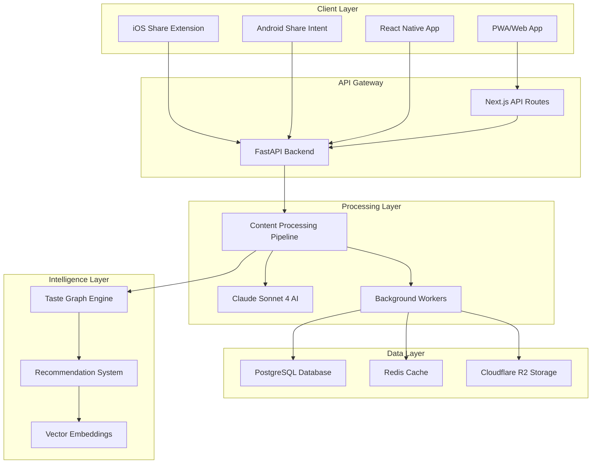
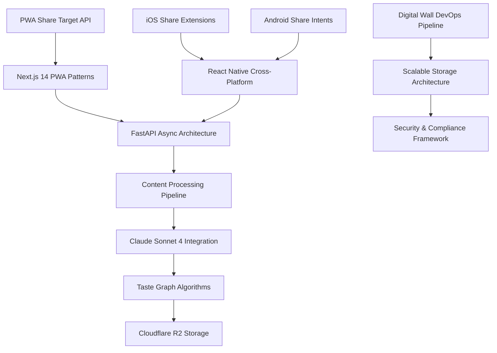

# Master Documentation Index

## Project Overview

The **Digital Wall Research Documentation** provides comprehensive technical guidance for implementing a modern content curation platform with native mobile sharing, AI-powered content understanding, and scalable cloud architecture. This index serves as the central navigation hub for all research documentation.

## Documentation Structure

### 📱 Core Technologies
Advanced web and mobile technologies forming the Digital Wall foundation.

- **[[PWA Share Target API]] - Digital Wall Implementation**  
  Native web sharing integration with iOS and Android share sheets, service worker patterns, and cross-platform compatibility.

- **[[Next.js 14 PWA Patterns]] - Advanced Implementation**  
  Server-side rendering optimization, App Router integration, React Server Components, and Edge Runtime deployment.

- **[[FastAPI Async Architecture]] - Backend Design**  
  High-performance async Python backend with PostgreSQL, Redis, background task processing, and comprehensive error handling.

- **[[Cloudflare R2 Storage]] - CDN Integration Patterns**  
  Zero-egress object storage with global CDN, image optimization, cost management, and performance optimization.

### 🤖 AI & Content Processing  
Intelligent content understanding and recommendation systems.

- **[[Claude Sonnet 4 Integration]] - AI Content Processing**  
  Advanced AI integration for content analysis, prompt engineering, cost optimization, and fallback strategies.

- **[[Content Processing Pipeline]] - AI-Powered Metadata Extraction**  
  End-to-end content processing orchestration, URL analysis, file processing, and enrichment workflows.

- **[[Taste Graph Algorithms]] - Recommendation Engine Design**  
  Vector embeddings, collaborative filtering, personalization algorithms, and serendipity engine implementation.

### 📱 Mobile Development
Native mobile integration and cross-platform architecture.

- **[[iOS Share Extensions]] - Native Integration Guide**  
  iOS Action Extensions, JavaScript Bridge communication, App Store compliance, and native sharing workflows.

- **[[Android Share Intents]] - Implementation Patterns**  
  Intent filters, background services, content validation, Play Store compliance, and native Android integration.

- **[[React Native Cross-Platform]] - Mobile Architecture**  
  Unified mobile development, native module bridges, shared business logic, and performance optimization.

### ⚙️ Production & DevOps
Enterprise deployment, monitoring, and operational excellence.

- **[[Digital Wall DevOps Pipeline]] - CI-CD Implementation**  
  GitHub Actions workflows, Kubernetes deployment, monitoring integration, and production deployment strategies.

- **[[Scalable Storage Architecture]] - R2-CDN-Redis Integration**  
  Distributed storage system, caching strategies, performance optimization, and cost-effective scaling patterns.

- **[[Security & Compliance Framework]] - DMCA and Data Protection**  
  Content moderation, legal compliance, security best practices, and privacy protection implementation.

## System Architecture Overview

## Key Integration Patterns

### Cross-Component Data Flow
1. **Content Ingestion**: Multi-platform content sharing → Validation → Processing Pipeline
2. **AI Enhancement**: Content Analysis → Metadata Extraction → Embeddings Generation  
3. **Storage & Retrieval**: R2 Object Storage → CDN Distribution → Database Indexing
4. **Personalization**: User Interactions → Taste Graph → Recommendation Engine
5. **Deployment**: CI/CD Pipeline → Kubernetes → Monitoring & Scaling

### Technology Stack Alignment
- **Frontend**: Next.js 14 + PWA + TypeScript + Tailwind CSS
- **Backend**: FastAPI + Python 3.11 + PostgreSQL + Redis
- **Mobile**: React Native + Native Modules (iOS/Android)
- **AI/ML**: Claude Sonnet 4 + Vector Embeddings + Recommendation Algorithms
- **Storage**: Cloudflare R2 + CDN + Global Edge Distribution
- **Infrastructure**: Kubernetes + Docker + GitHub Actions + Monitoring Stack

## Implementation Roadmap

### Phase 1: Core Platform (Weeks 1-6)
- [x] **[[PWA Share Target API]]** - Web sharing foundation
- [x] **[[FastAPI Async Architecture]]** - Backend API development
- [x] **[[Content Processing Pipeline]]** - Basic content handling
- [x] **[[Cloudflare R2 Storage]]** - File storage integration

### Phase 2: Intelligence Layer (Weeks 7-12)
- [x] **[[Claude Sonnet 4 Integration]]** - AI content analysis
- [x] **[[Taste Graph Algorithms]]** - Recommendation engine
- [x] **[[Next.js 14 PWA Patterns]]** - Advanced frontend features

### Phase 3: Mobile Expansion (Weeks 13-18)
- [x] **[[iOS Share Extensions]]** - Native iOS integration
- [x] **[[Android Share Intents]]** - Native Android integration
- [x] **[[React Native Cross-Platform]]** - Unified mobile app

### Phase 4: Production Readiness (Weeks 19-24)
- [x] **[[Digital Wall DevOps Pipeline]]** - CI/CD automation
- [x] **[[Scalable Storage Architecture]]** - Performance optimization  
- [x] **[[Security & Compliance Framework]]** - Legal and security hardening

## Development Guidelines

### Code Quality Standards
- **Type Safety**: TypeScript for all frontend code, Python typing for backend
- **Testing**: Unit tests (90%+ coverage), integration tests, E2E testing
- **Documentation**: Inline code documentation, API documentation, README files
- **Security**: OWASP compliance, dependency scanning, security testing

### Architecture Principles
- **Microservices**: Loosely coupled, independently deployable services
- **API-First**: RESTful APIs with comprehensive OpenAPI documentation
- **Cloud-Native**: Kubernetes-ready, horizontally scalable, resilient
- **Performance**: < 2s page load, < 500ms API response, 99.9% uptime

### Deployment Strategy
- **Environments**: Development → Staging → Production
- **Blue-Green**: Zero-downtime deployments with rollback capabilities
- **Monitoring**: Real-time metrics, alerting, log aggregation
- **Security**: Secrets management, SSL/TLS, network policies

## Cross-References and Dependencies

### Technical Dependencies

### Business Logic Flow
1. **User Shares Content** → PWA/Mobile App → API Gateway
2. **Content Processing** → AI Analysis → Metadata Extraction → Storage
3. **Personalization** → Taste Graph → Recommendations → User Feed
4. **Monitoring** → Metrics Collection → Alerting → Performance Optimization

## Getting Started

### For Developers
1. Review **[[FastAPI Async Architecture]]** for backend setup
2. Study **[[Next.js 14 PWA Patterns]]** for frontend development
3. Implement **[[PWA Share Target API]]** for sharing functionality
4. Integrate **[[Claude Sonnet 4 Integration]]** for AI capabilities

### For DevOps Engineers  
1. Setup **[[Digital Wall DevOps Pipeline]]** for CI/CD
2. Configure **[[Scalable Storage Architecture]]** for infrastructure
3. Implement **[[Security & Compliance Framework]]** for production readiness

### For Mobile Developers
1. Start with **[[React Native Cross-Platform]]** architecture
2. Implement **[[iOS Share Extensions]]** for iOS native features
3. Develop **[[Android Share Intents]]** for Android integration

## Success Metrics

### Technical KPIs
- **Performance**: < 2s page load, < 500ms API response
- **Availability**: 99.9% uptime, < 1 minute MTTR
- **Scalability**: Support 100K+ users, 1M+ content items
- **Quality**: 90%+ test coverage, zero critical security issues

### User Experience
- **Share Success Rate**: 95%+ successful content sharing
- **Content Discovery**: 30%+ engagement with recommendations  
- **Cross-Platform**: Consistent experience across web and mobile
- **Performance**: Smooth 60fps interactions, instant feedback

## Related Resources

### External Documentation
- [Obsidian Vault Standards](obsidian://vault/standards)
- [Digital Wall PRD](obsidian://vault/DigitalWall-PRD)
- [Digital Wall BRD](obsidian://vault/DigitalWall-BRD)  
- [MVP Roadmap](obsidian://vault/DigitalWall-MVP-Roadmap)

### Technology References
- [Next.js Documentation](https://nextjs.org/docs)
- [FastAPI Documentation](https://fastapi.tiangolo.com/)
- [React Native Documentation](https://reactnative.dev/)
- [Kubernetes Documentation](https://kubernetes.io/docs/)

---

*This research documentation provides the technical foundation for implementing the Digital Wall platform. Each document contains detailed implementation guidance, code examples, and production considerations for building a scalable, intelligent content curation system.*

#digital-wall #research #index #architecture #documentation