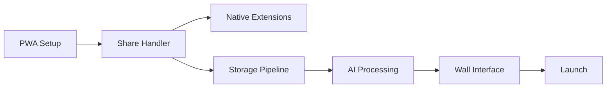

# MVP Roadmap - 6 Week Sprint to Launch
## "From Zero to Native Share Menu Supremacy"

### Pre-Sprint: Foundation (Week 0)
**Goal**: Set up the chassis before we start adding the turbo

```bash
- Initialize Next.js PWA with share target manifest
- PostgreSQL + Redis docker-compose setup  
- Cloudflare R2 bucket configuration
- Basic CI/CD pipeline (GitHub Actions)
- Claude Sonnet 4 API integration setup
```

**Success Criteria**: Dev can share a link from phone to local PWA

---

### Sprint 1: Core Share Functionality (Week 1-2)
**Theme**: "Making sharing not suck"

#### Week 1: Share Handler Infrastructure
```typescript
// Priority tasks
- [ ] Web Share Target API implementation
- [ ] PWA manifest with share_target
- [ ] Basic share handler endpoint
- [ ] Content type detection (link/text/image)
- [ ] Temporary storage for anonymous users
```

#### Week 2: Native App Share Extensions
```typescript
// iOS Share Extension
- [ ] Action Extension setup
- [ ] JavaScript preprocessing
- [ ] API communication layer

// Android 
- [ ] Intent filter configuration
- [ ] Share sheet customization
- [ ] Background upload service
```

**Deliverable**: Share any link from mobile → appears on web wall

---

### Sprint 2: Storage & Intelligence (Week 3-4)
**Theme**: "Teaching computers to understand vibes"

#### Week 3: Content Processing Pipeline
```python
Tasks = [
    "Cloudflare R2 upload pipeline",
    "Preview generation service",
    "Claude API integration for metadata",
    "Basic content deduplication",
    "Async job queue with BullMQ"
]
```

#### Week 4: Wall Management
```python
Features = [
    "Wall creation (anonymous + registered)",
    "Item CRUD operations",
    "Privacy settings (public/private/unlisted)",
    "Basic grid layout UI",
    "Mobile-optimized interface"
]
```

**Deliverable**: Functional wall with AI-enriched content

---

### Sprint 3: Polish & Launch Prep (Week 5-6)
**Theme**: "Making it pretty enough to ship"

#### Week 5: UI/UX Polish
- Responsive masonry grid
- Smooth animations (Framer Motion)
- Loading states that don't suck
- Error handling with personality
- Share success feedback

#### Week 6: Launch Readiness
- Rate limiting implementation
- Basic analytics (Plausible)
- DMCA notice system (automated)
- Terms of Service / Privacy Policy
- Production deployment to Vercel/Railway

**Deliverable**: Public beta launch

---

### Technical Milestones & Checkpoints

| Week | Milestone | Success Metric |
|------|-----------|----------------|
| 1 | Share handler works | Can share from Safari/Chrome to PWA |
| 2 | Native extensions | iOS/Android share menus include our app |
| 3 | AI understands content | Shared links get meaningful metadata |
| 4 | Walls are persistent | Users can create and manage walls |
| 5 | It looks good | Your designer friend doesn't roast you |
| 6 | It's live | Real humans are sharing real content |

### Critical Path Dependencies


### MVP Feature Cuts (What We're NOT Building)
- ❌ DM automation (P1 feature)
- ❌ Taste graph algorithm (P1 feature)
- ❌ Collaborative walls
- ❌ Export functionality
- ❌ Payment processing
- ❌ Advanced analytics

### Risk Register & Mitigations

| Risk | Impact | Mitigation |
|------|--------|------------|
| Apple rejects share extension | High | PWA-first strategy, Safari share fallback |
| Share API browser support | Medium | Clipboard fallback, clear instructions |
| Storage costs explode | Medium | Aggressive limits for free tier |
| DMCA spam | Low | Automated handling, clear TOS |

### Post-MVP Immediate Priorities
1. **Week 7-8**: DM automation for premium
2. **Week 9-10**: Taste graph algorithm
3. **Week 11-12**: Discovery feed

### Success Metrics for MVP
- 1000 shares in first week
- 100 active walls
- <2s page load on 4G
- 50% mobile traffic
- Zero copyright strikes

### The DMCA Reality Check
**Can you forward to /dev/null?** Legally no, practically... still no 💀
- You MUST have a registered DMCA agent
- You MUST respond to valid notices
- You CAN automate the process
- You CAN'T ignore them without consequences

**The Smart Play**: 
1. Automated DMCA system that removes content immediately
2. Counter-notice process for users
3. Three-strike policy for repeat offenders
4. Turkish company structure for additional protection

Remember: Platforms get safe harbor protection IF they comply with DMCA. Don't be the genius who loses protection over laziness.