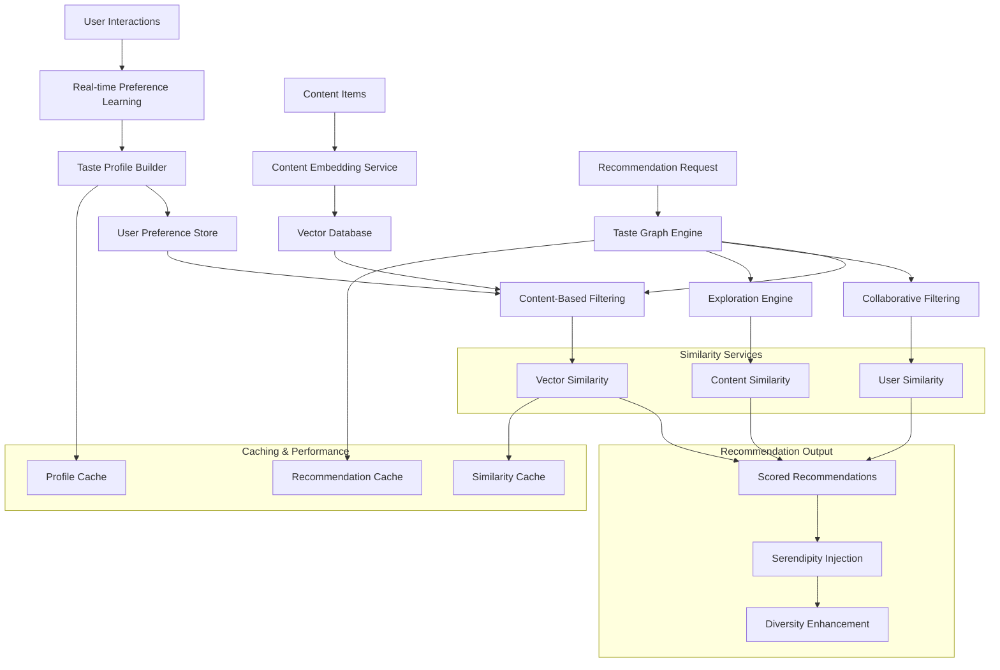

# [[Taste Graph Algorithms]] - Recommendation Engine Design

## Overview & Core Concepts

The **Taste Graph** represents the intelligent recommendation system at the heart of [[Digital Wall]], learning user preferences and content relationships to provide personalized content discovery. This document covers advanced recommendation algorithms, vector similarity techniques, and collaborative filtering approaches optimized for personal content curation.

### Core Algorithm Components
- **[[Vector Embeddings]]**: Content representation in high-dimensional space
- **[[Collaborative Filtering]]**: User-based and item-based recommendation patterns
- **[[Content Similarity]]**: Semantic and contextual content matching
- **[[Preference Learning]]**: Dynamic user taste modeling and adaptation
- **[[Discovery Algorithms]]**: Serendipity and exploration balancing with relevance

## Technical Deep Dive

### Embedding Generation and Vector Storage

```python
# app/services/embedding_service.py - Content embedding generation
import asyncio
import numpy as np
from typing import Dict, Any, List, Optional, Tuple
import logging
from datetime import datetime, timedelta
import json
import hashlib

from app.core.database import AsyncSessionLocal
from app.core.redis import get_redis_client
from app.services.ai_service import ClaudeSonnet4Client
from sentence_transformers import SentenceTransformer
import faiss

logger = logging.getLogger(__name__)

class ContentEmbeddingService:
    def __init__(self):
        # Use a multilingual sentence transformer for better semantic understanding
        self.model = SentenceTransformer('all-MiniLM-L6-v2')
        self.embedding_dimension = 384  # Dimension of all-MiniLM-L6-v2
        self.redis = get_redis_client()
        self.claude_client = ClaudeSonnet4Client()
        
        # FAISS index for fast similarity search
        self.index = faiss.IndexFlatIP(self.embedding_dimension)  # Inner product (cosine similarity)
        self.content_id_map = {}  # Map FAISS index to content IDs
        self.index_loaded = False
    
    async def generate_content_embedding(
        self,
        content_data: Dict[str, Any],
        use_ai_enhancement: bool = True
    ) -> np.ndarray:
        """Generate comprehensive embedding for content item"""
        
        try:
            # Prepare text for embedding
            embedding_text = self._prepare_embedding_text(content_data)
            
            # AI-enhanced text generation
            if use_ai_enhancement and content_data.get('ai_analysis'):
                enhanced_text = self._create_enhanced_text(content_data)
                embedding_text = f"{embedding_text} {enhanced_text}"
            
            # Generate embedding
            embedding = self.model.encode(embedding_text, convert_to_tensor=False)
            
            # Normalize for cosine similarity
            embedding = embedding / np.linalg.norm(embedding)
            
            logger.debug(f"Generated embedding for content {content_data.get('id', 'unknown')}")
            return embedding.astype(np.float32)
            
        except Exception as e:
            logger.error(f"Embedding generation failed: {e}")
            # Return zero vector as fallback
            return np.zeros(self.embedding_dimension, dtype=np.float32)
    
    def _prepare_embedding_text(self, content_data: Dict[str, Any]) -> str:
        """Prepare text content for embedding generation"""
        
        text_parts = []
        
        # Title
        if content_data.get('title'):
            text_parts.append(content_data['title'])
        
        # Description
        if content_data.get('description'):
            text_parts.append(content_data['description'])
        
        # Primary content (truncated for performance)
        if content_data.get('primary_content'):
            content = content_data['primary_content'][:500]  # Limit to 500 chars
            text_parts.append(content)
        
        # Tags
        if content_data.get('tags'):
            tags_text = ' '.join(content_data['tags'])
            text_parts.append(f"Tags: {tags_text}")
        
        # Category
        if content_data.get('category'):
            text_parts.append(f"Category: {content_data['category']}")
        
        return ' '.join(text_parts)
    
    def _create_enhanced_text(self, content_data: Dict[str, Any]) -> str:
        """Create AI-enhanced text for better embeddings"""
        
        ai_analysis = content_data.get('ai_analysis', {})
        enhanced_parts = []
        
        # Add AI-generated topics
        if ai_analysis.get('topics'):
            topics_text = ' '.join(ai_analysis['topics'])
            enhanced_parts.append(f"Topics: {topics_text}")
        
        # Add sentiment context
        if ai_analysis.get('sentiment'):
            enhanced_parts.append(f"Sentiment: {ai_analysis['sentiment']}")
        
        # Add quality indicators
        if ai_analysis.get('quality_score', 0) > 0.7:
            enhanced_parts.append("High quality content")
        
        # Add reasoning context
        if ai_analysis.get('reasoning'):
            reasoning = ai_analysis['reasoning'][:100]  # Limit length
            enhanced_parts.append(reasoning)
        
        return ' '.join(enhanced_parts)
    
    async def store_embedding(
        self,
        content_id: str,
        embedding: np.ndarray,
        metadata: Optional[Dict[str, Any]] = None
    ):
        """Store embedding in both FAISS index and Redis"""
        
        try:
            # Store in FAISS index
            index_id = self.index.ntotal
            self.index.add(embedding.reshape(1, -1))
            self.content_id_map[index_id] = content_id
            
            # Store mapping and metadata in Redis
            await self.redis.hset(
                'embedding_index_map',
                index_id,
                content_id
            )
            
            # Store embedding metadata
            if metadata:
                await self.redis.setex(
                    f"embedding_meta:{content_id}",
                    86400 * 7,  # 7 days TTL
                    json.dumps(metadata)
                )
            
            # Store raw embedding for backup/analysis
            embedding_key = f"embedding:{content_id}"
            await self.redis.setex(
                embedding_key,
                86400 * 30,  # 30 days TTL
                embedding.tobytes()
            )
            
            logger.debug(f"Stored embedding for content {content_id}")
            
        except Exception as e:
            logger.error(f"Embedding storage failed: {e}")
    
    async def find_similar_content(
        self,
        query_embedding: np.ndarray,
        k: int = 10,
        user_id: Optional[str] = None,
        exclude_ids: Optional[List[str]] = None
    ) -> List[Tuple[str, float]]:
        """Find similar content using vector similarity"""
        
        try:
            if self.index.ntotal == 0:
                await self._load_index()
            
            # Search for similar vectors
            query_embedding = query_embedding.reshape(1, -1)
            similarities, indices = self.index.search(query_embedding, k * 2)  # Get more for filtering
            
            # Convert to content IDs and filter
            similar_content = []
            exclude_set = set(exclude_ids or [])
            
            for i, (similarity, index) in enumerate(zip(similarities[0], indices[0])):
                if index == -1:  # FAISS returns -1 for invalid indices
                    continue
                
                content_id = self.content_id_map.get(index)
                if not content_id or content_id in exclude_set:
                    continue
                
                # Apply user-specific filtering if needed
                if user_id:
                    if not await self._is_content_accessible(content_id, user_id):
                        continue
                
                similar_content.append((content_id, float(similarity)))
                
                if len(similar_content) >= k:
                    break
            
            return similar_content
            
        except Exception as e:
            logger.error(f"Similarity search failed: {e}")
            return []
    
    async def _load_index(self):
        """Load FAISS index from storage"""
        try:
            # This would load from persistent storage in production
            logger.info("FAISS index loaded (placeholder implementation)")
            self.index_loaded = True
        except Exception as e:
            logger.error(f"Failed to load FAISS index: {e}")
    
    async def _is_content_accessible(self, content_id: str, user_id: str) -> bool:
        """Check if content is accessible to user (privacy, permissions)"""
        # Placeholder implementation
        return True

class TasteGraphEngine:
    def __init__(self):
        self.embedding_service = ContentEmbeddingService()
        self.redis = get_redis_client()
        
        # Recommendation parameters
        self.content_weight = 0.6      # Weight for content-based recommendations
        self.collaborative_weight = 0.3 # Weight for collaborative filtering
        self.exploration_weight = 0.1   # Weight for exploration/serendipity
    
    async def build_user_taste_profile(
        self,
        user_id: str,
        lookback_days: int = 30
    ) -> Dict[str, Any]:
        """Build comprehensive taste profile for user"""
        
        try:
            # Get user's recent interactions
            interactions = await self._get_user_interactions(user_id, lookback_days)
            
            if not interactions:
                return self._create_default_profile()
            
            # Analyze interaction patterns
            profile = {
                'user_id': user_id,
                'created_at': datetime.now().isoformat(),
                'interaction_count': len(interactions),
                'preferences': {},
                'categories': {},
                'topics': {},
                'sentiment_preference': {},
                'quality_threshold': 0.5,
                'diversity_preference': 0.5
            }
            
            # Analyze categories
            category_scores = {}
            category_interactions = {}
            
            for interaction in interactions:
                content = interaction.get('content', {})
                category = content.get('category', 'other')
                engagement_score = self._calculate_engagement_score(interaction)
                
                if category not in category_scores:
                    category_scores[category] = []
                    category_interactions[category] = 0
                
                category_scores[category].append(engagement_score)
                category_interactions[category] += 1
            
            # Calculate category preferences
            for category, scores in category_scores.items():
                avg_engagement = np.mean(scores)
                interaction_frequency = category_interactions[category] / len(interactions)
                
                profile['categories'][category] = {
                    'preference_score': float(avg_engagement * 0.7 + interaction_frequency * 0.3),
                    'engagement_avg': float(avg_engagement),
                    'interaction_count': category_interactions[category]
                }
            
            # Analyze topics
            topic_scores = {}
            for interaction in interactions:
                content = interaction.get('content', {})
                topics = content.get('topics', [])
                engagement_score = self._calculate_engagement_score(interaction)
                
                for topic in topics:
                    if topic not in topic_scores:
                        topic_scores[topic] = []
                    topic_scores[topic].append(engagement_score)
            
            # Calculate topic preferences
            for topic, scores in topic_scores.items():
                if len(scores) >= 2:  # Require at least 2 interactions
                    profile['topics'][topic] = {
                        'preference_score': float(np.mean(scores)),
                        'interaction_count': len(scores)
                    }
            
            # Analyze sentiment preferences
            sentiment_scores = {}
            for interaction in interactions:
                content = interaction.get('content', {})
                sentiment = content.get('sentiment', 'neutral')
                engagement_score = self._calculate_engagement_score(interaction)
                
                if sentiment not in sentiment_scores:
                    sentiment_scores[sentiment] = []
                sentiment_scores[sentiment].append(engagement_score)
            
            for sentiment, scores in sentiment_scores.items():
                profile['sentiment_preference'][sentiment] = float(np.mean(scores))
            
            # Calculate quality threshold
            quality_scores = []
            for interaction in interactions:
                content = interaction.get('content', {})
                quality = content.get('quality_score', 0.5)
                engagement_score = self._calculate_engagement_score(interaction)
                
                if engagement_score > 0.7:  # High engagement
                    quality_scores.append(quality)
            
            if quality_scores:
                profile['quality_threshold'] = float(np.percentile(quality_scores, 25))  # 25th percentile
            
            # Store profile
            await self._store_user_profile(user_id, profile)
            
            return profile
            
        except Exception as e:
            logger.error(f"Failed to build taste profile for {user_id}: {e}")
            return self._create_default_profile()
    
    def _calculate_engagement_score(self, interaction: Dict[str, Any]) -> float:
        """Calculate engagement score from interaction data"""
        
        score = 0.0
        
        # Time spent (if available)
        time_spent = interaction.get('time_spent_seconds', 0)
        if time_spent > 0:
            # Normalize time spent (cap at 300 seconds = 5 minutes)
            time_score = min(time_spent / 300.0, 1.0)
            score += time_score * 0.4
        
        # Action-based scoring
        action = interaction.get('action', '')
        action_scores = {
            'view': 0.1,
            'like': 0.6,
            'share': 0.8,
            'save': 0.7,
            'comment': 0.9,
            'click': 0.3
        }
        score += action_scores.get(action, 0.1) * 0.6
        
        return min(score, 1.0)
    
    async def generate_recommendations(
        self,
        user_id: str,
        count: int = 20,
        diversity_boost: float = 0.1
    ) -> List[Dict[str, Any]]:
        """Generate personalized content recommendations"""
        
        try:
            # Get user taste profile
            profile = await self._get_user_profile(user_id)
            if not profile:
                profile = await self.build_user_taste_profile(user_id)
            
            # Get candidate content
            candidates = await self._get_candidate_content(user_id, count * 3)  # Get more for filtering
            
            if not candidates:
                return []
            
            # Score candidates using multiple strategies
            recommendations = []
            
            for candidate in candidates:
                content_score = await self._score_content_based(candidate, profile)
                collaborative_score = await self._score_collaborative(candidate, user_id)
                exploration_score = self._score_exploration(candidate, profile)
                
                # Combined score
                total_score = (
                    content_score * self.content_weight +
                    collaborative_score * self.collaborative_weight +
                    exploration_score * self.exploration_weight
                )
                
                recommendations.append({
                    'content': candidate,
                    'total_score': total_score,
                    'content_score': content_score,
                    'collaborative_score': collaborative_score,
                    'exploration_score': exploration_score,
                    'reasoning': self._generate_recommendation_reasoning(
                        candidate, profile, content_score, collaborative_score
                    )
                })
            
            # Sort by score
            recommendations.sort(key=lambda x: x['total_score'], reverse=True)
            
            # Apply diversity if requested
            if diversity_boost > 0:
                recommendations = self._apply_diversity_boost(
                    recommendations, diversity_boost
                )
            
            # Return top recommendations
            return recommendations[:count]
            
        except Exception as e:
            logger.error(f"Recommendation generation failed for {user_id}: {e}")
            return []
    
    async def _score_content_based(
        self,
        candidate: Dict[str, Any],
        profile: Dict[str, Any]
    ) -> float:
        """Score candidate using content-based filtering"""
        
        score = 0.0
        
        # Category preference
        category = candidate.get('category', 'other')
        category_pref = profile.get('categories', {}).get(category, {})
        if category_pref:
            score += category_pref.get('preference_score', 0.5) * 0.4
        
        # Topic preferences
        candidate_topics = candidate.get('topics', [])
        topic_scores = []
        
        for topic in candidate_topics:
            topic_pref = profile.get('topics', {}).get(topic, {})
            if topic_pref:
                topic_scores.append(topic_pref.get('preference_score', 0.5))
        
        if topic_scores:
            score += np.mean(topic_scores) * 0.3
        
        # Sentiment preference
        sentiment = candidate.get('sentiment', 'neutral')
        sentiment_pref = profile.get('sentiment_preference', {}).get(sentiment, 0.5)
        score += sentiment_pref * 0.2
        
        # Quality filter
        quality = candidate.get('quality_score', 0.5)
        quality_threshold = profile.get('quality_threshold', 0.5)
        if quality < quality_threshold:
            score *= 0.5  # Penalty for low quality
        
        return min(score, 1.0)
    
    async def _score_collaborative(
        self,
        candidate: Dict[str, Any],
        user_id: str
    ) -> float:
        """Score candidate using collaborative filtering"""
        
        try:
            # Find similar users
            similar_users = await self._find_similar_users(user_id, k=10)
            
            if not similar_users:
                return 0.5  # Neutral score if no similar users
            
            # Check how similar users interacted with this content
            content_id = candidate.get('id')
            positive_interactions = 0
            total_interactions = 0
            
            for similar_user_id, similarity_score in similar_users:
                interaction = await self._get_user_content_interaction(
                    similar_user_id, content_id
                )
                
                if interaction:
                    total_interactions += 1
                    engagement_score = self._calculate_engagement_score(interaction)
                    
                    # Weight by user similarity
                    weighted_engagement = engagement_score * similarity_score
                    if weighted_engagement > 0.5:
                        positive_interactions += 1
            
            if total_interactions == 0:
                return 0.5  # No data available
            
            return positive_interactions / total_interactions
            
        except Exception as e:
            logger.warning(f"Collaborative scoring failed: {e}")
            return 0.5
    
    def _score_exploration(
        self,
        candidate: Dict[str, Any],
        profile: Dict[str, Any]
    ) -> float:
        """Score candidate for exploration/serendipity"""
        
        # Favor content from categories user hasn't explored much
        category = candidate.get('category', 'other')
        category_pref = profile.get('categories', {}).get(category, {})
        interaction_count = category_pref.get('interaction_count', 0)
        
        # Lower interaction count = higher exploration score
        exploration_score = 1.0 / (1.0 + interaction_count * 0.1)
        
        # Boost for high-quality unexplored content
        quality = candidate.get('quality_score', 0.5)
        if quality > 0.8 and interaction_count < 3:
            exploration_score *= 1.5
        
        return min(exploration_score, 1.0)
```

### Real-time Preference Learning

```python
# app/services/preference_learning.py - Dynamic taste learning
import asyncio
from typing import Dict, Any, List, Optional
import logging
from datetime import datetime, timedelta
import numpy as np
from collections import defaultdict

logger = logging.getLogger(__name__)

class RealTimePreferenceLearner:
    def __init__(self, taste_graph: TasteGraphEngine):
        self.taste_graph = taste_graph
        self.learning_rate = 0.1
        self.decay_factor = 0.95  # How quickly preferences decay over time
    
    async def update_preferences_from_interaction(
        self,
        user_id: str,
        content_id: str,
        interaction_type: str,
        context: Optional[Dict[str, Any]] = None
    ):
        """Update user preferences based on real-time interaction"""
        
        try:
            # Get content details
            content = await self._get_content_details(content_id)
            if not content:
                logger.warning(f"Content not found for preference learning: {content_id}")
                return
            
            # Calculate interaction value
            interaction_value = self._calculate_interaction_value(
                interaction_type, context
            )
            
            # Update various preference dimensions
            await self._update_category_preferences(
                user_id, content.get('category'), interaction_value
            )
            
            await self._update_topic_preferences(
                user_id, content.get('topics', []), interaction_value
            )
            
            await self._update_quality_preferences(
                user_id, content.get('quality_score', 0.5), interaction_value
            )
            
            await self._update_sentiment_preferences(
                user_id, content.get('sentiment', 'neutral'), interaction_value
            )
            
            # Update temporal patterns
            await self._update_temporal_preferences(
                user_id, content, interaction_value, datetime.now()
            )
            
            # Trigger profile refresh if significant change
            if abs(interaction_value) > 0.5:
                await self._schedule_profile_refresh(user_id)
            
            logger.debug(f"Updated preferences for {user_id} based on {interaction_type}")
            
        except Exception as e:
            logger.error(f"Preference learning failed: {e}")
    
    def _calculate_interaction_value(
        self,
        interaction_type: str,
        context: Optional[Dict[str, Any]]
    ) -> float:
        """Calculate the value of an interaction for learning"""
        
        base_values = {
            'view': 0.1,
            'like': 0.6,
            'share': 0.8,
            'save': 0.7,
            'comment': 0.9,
            'click': 0.3,
            'dismiss': -0.2,
            'hide': -0.5,
            'report': -0.8
        }
        
        value = base_values.get(interaction_type, 0.1)
        
        # Context adjustments
        if context:
            # Time spent adjustment
            time_spent = context.get('time_spent_seconds', 0)
            if time_spent > 30:  # More than 30 seconds
                value *= 1.2
            elif time_spent < 5:  # Less than 5 seconds
                value *= 0.8
            
            # Source adjustment (native share is more valuable)
            source = context.get('source', '')
            if source == 'native_share':
                value *= 1.3
            
            # Repeat interaction penalty
            repeat_count = context.get('repeat_interaction_count', 0)
            if repeat_count > 0:
                value *= (0.9 ** repeat_count)  # Diminishing returns
        
        return np.clip(value, -1.0, 1.0)
    
    async def _update_category_preferences(
        self,
        user_id: str,
        category: Optional[str],
        interaction_value: float
    ):
        """Update category preferences with exponential moving average"""
        
        if not category:
            return
        
        # Get current preference
        current_pref = await self._get_category_preference(user_id, category)
        
        # Update with exponential moving average
        new_pref = (
            current_pref * (1 - self.learning_rate) + 
            interaction_value * self.learning_rate
        )
        
        # Store updated preference
        await self._store_category_preference(user_id, category, new_pref)
    
    async def _update_topic_preferences(
        self,
        user_id: str,
        topics: List[str],
        interaction_value: float
    ):
        """Update topic preferences"""
        
        if not topics:
            return
        
        # Distribute interaction value across topics
        topic_value = interaction_value / len(topics)
        
        for topic in topics:
            current_pref = await self._get_topic_preference(user_id, topic)
            new_pref = (
                current_pref * (1 - self.learning_rate) + 
                topic_value * self.learning_rate
            )
            await self._store_topic_preference(user_id, topic, new_pref)
    
    async def predict_user_interest(
        self,
        user_id: str,
        content_features: Dict[str, Any]
    ) -> float:
        """Predict user interest in content based on learned preferences"""
        
        try:
            interest_score = 0.0
            
            # Category interest
            category = content_features.get('category')
            if category:
                category_pref = await self._get_category_preference(user_id, category)
                interest_score += category_pref * 0.4
            
            # Topic interests
            topics = content_features.get('topics', [])
            if topics:
                topic_scores = []
                for topic in topics:
                    topic_pref = await self._get_topic_preference(user_id, topic)
                    topic_scores.append(topic_pref)
                
                if topic_scores:
                    interest_score += np.mean(topic_scores) * 0.3
            
            # Quality preference
            quality = content_features.get('quality_score', 0.5)
            quality_pref = await self._get_quality_preference(user_id)
            
            if quality >= quality_pref:
                interest_score += 0.2
            else:
                interest_score -= 0.1
            
            # Sentiment preference
            sentiment = content_features.get('sentiment', 'neutral')
            sentiment_pref = await self._get_sentiment_preference(user_id, sentiment)
            interest_score += sentiment_pref * 0.1
            
            return np.clip(interest_score, 0.0, 1.0)
            
        except Exception as e:
            logger.error(f"Interest prediction failed: {e}")
            return 0.5  # Neutral prediction

class SerendipityEngine:
    """Engine for introducing serendipitous recommendations"""
    
    def __init__(self):
        self.exploration_rate = 0.15  # 15% of recommendations for exploration
        self.novelty_bonus = 0.2      # Bonus for novel content
    
    async def inject_serendipity(
        self,
        user_id: str,
        base_recommendations: List[Dict[str, Any]],
        exploration_rate: Optional[float] = None
    ) -> List[Dict[str, Any]]:
        """Inject serendipitous recommendations into base set"""
        
        exploration_rate = exploration_rate or self.exploration_rate
        num_to_replace = int(len(base_recommendations) * exploration_rate)
        
        if num_to_replace == 0:
            return base_recommendations
        
        try:
            # Get serendipitous candidates
            serendipity_candidates = await self._get_serendipity_candidates(
                user_id, num_to_replace * 3
            )
            
            # Score and select best serendipitous items
            scored_candidates = []
            for candidate in serendipity_candidates:
                novelty_score = await self._calculate_novelty_score(user_id, candidate)
                quality_score = candidate.get('quality_score', 0.5)
                
                # Combine novelty and quality
                serendipity_score = novelty_score * 0.6 + quality_score * 0.4
                
                scored_candidates.append({
                    'content': candidate,
                    'serendipity_score': serendipity_score,
                    'novelty_score': novelty_score
                })
            
            # Sort by serendipity score
            scored_candidates.sort(key=lambda x: x['serendipity_score'], reverse=True)
            
            # Replace lowest-scoring base recommendations with serendipitous ones
            base_recommendations.sort(key=lambda x: x['total_score'])
            
            for i in range(num_to_replace):
                if i < len(scored_candidates):
                    serendipity_item = scored_candidates[i]
                    
                    # Convert to recommendation format
                    recommendation = {
                        'content': serendipity_item['content'],
                        'total_score': serendipity_item['serendipity_score'],
                        'content_score': 0.0,
                        'collaborative_score': 0.0,
                        'exploration_score': serendipity_item['novelty_score'],
                        'reasoning': f"Serendipitous discovery - exploring new interests (novelty: {serendipity_item['novelty_score']:.2f})"
                    }
                    
                    base_recommendations[i] = recommendation
            
            # Re-shuffle to distribute serendipitous items
            np.random.shuffle(base_recommendations)
            
            return base_recommendations
            
        except Exception as e:
            logger.error(f"Serendipity injection failed: {e}")
            return base_recommendations
    
    async def _get_serendipity_candidates(
        self,
        user_id: str,
        count: int
    ) -> List[Dict[str, Any]]:
        """Get candidates for serendipitous recommendations"""
        
        # Get user's interaction history to understand what they haven't explored
        user_categories = await self._get_user_explored_categories(user_id)
        user_topics = await self._get_user_explored_topics(user_id)
        
        # Find content from unexplored categories/topics
        candidates = await self._get_content_outside_preferences(
            user_categories, user_topics, count
        )
        
        return candidates
    
    async def _calculate_novelty_score(
        self,
        user_id: str,
        content: Dict[str, Any]
    ) -> float:
        """Calculate how novel content is for the user"""
        
        novelty_score = 0.0
        
        # Category novelty
        category = content.get('category', 'other')
        user_category_interactions = await self._get_user_category_interactions(
            user_id, category
        )
        
        if user_category_interactions == 0:
            novelty_score += 0.4  # Completely new category
        elif user_category_interactions < 3:
            novelty_score += 0.2  # Rarely explored category
        
        # Topic novelty
        topics = content.get('topics', [])
        novel_topics = 0
        
        for topic in topics:
            topic_interactions = await self._get_user_topic_interactions(user_id, topic)
            if topic_interactions == 0:
                novel_topics += 1
        
        if topics:
            novelty_score += (novel_topics / len(topics)) * 0.3
        
        # Temporal novelty (recently trending but user hasn't seen)
        if await self._is_trending_content(content.get('id')):
            novelty_score += 0.3
        
        return min(novelty_score, 1.0)
```

## Production Considerations

### Scalability and Performance

```python
# app/services/recommendation_cache.py - Caching and performance optimization
import asyncio
from typing import Dict, Any, List, Optional
import json
import logging
from datetime import datetime, timedelta

logger = logging.getLogger(__name__)

class RecommendationCacheManager:
    def __init__(self, redis_client):
        self.redis = redis_client
        self.cache_ttl = {
            'recommendations': 3600,      # 1 hour
            'user_profile': 86400,        # 24 hours
            'similarity_index': 86400 * 7, # 7 days
            'trending_content': 1800       # 30 minutes
        }
    
    async def get_cached_recommendations(
        self,
        user_id: str,
        count: int,
        context: Optional[Dict[str, Any]] = None
    ) -> Optional[List[Dict[str, Any]]]:
        """Get cached recommendations for user"""
        
        cache_key = self._build_recommendation_cache_key(user_id, count, context)
        
        try:
            cached_data = await self.redis.get(cache_key)
            if cached_data:
                recommendations = json.loads(cached_data)
                
                # Check if recommendations are still fresh
                cache_timestamp = recommendations.get('timestamp')
                if cache_timestamp:
                    cache_time = datetime.fromisoformat(cache_timestamp)
                    if datetime.now() - cache_time < timedelta(hours=1):
                        logger.debug(f"Returning cached recommendations for {user_id}")
                        return recommendations.get('items', [])
                
        except Exception as e:
            logger.warning(f"Cache retrieval error: {e}")
        
        return None
    
    async def cache_recommendations(
        self,
        user_id: str,
        recommendations: List[Dict[str, Any]],
        count: int,
        context: Optional[Dict[str, Any]] = None
    ):
        """Cache recommendations for user"""
        
        cache_key = self._build_recommendation_cache_key(user_id, count, context)
        
        cache_data = {
            'user_id': user_id,
            'items': recommendations,
            'timestamp': datetime.now().isoformat(),
            'count': count
        }
        
        try:
            await self.redis.setex(
                cache_key,
                self.cache_ttl['recommendations'],
                json.dumps(cache_data, default=str)
            )
            
            logger.debug(f"Cached recommendations for {user_id}")
            
        except Exception as e:
            logger.warning(f"Cache storage error: {e}")
    
    async def invalidate_user_cache(self, user_id: str):
        """Invalidate all cached data for a user"""
        
        pattern = f"rec:*:{user_id}:*"
        
        try:
            keys = await self.redis.keys(pattern)
            if keys:
                await self.redis.delete(*keys)
                logger.debug(f"Invalidated cache for user {user_id}")
                
        except Exception as e:
            logger.warning(f"Cache invalidation error: {e}")
    
    def _build_recommendation_cache_key(
        self,
        user_id: str,
        count: int,
        context: Optional[Dict[str, Any]]
    ) -> str:
        """Build cache key for recommendations"""
        
        context_hash = ""
        if context:
            # Create hash of context for cache key
            import hashlib
            context_str = json.dumps(context, sort_keys=True)
            context_hash = hashlib.md5(context_str.encode()).hexdigest()[:8]
        
        return f"rec:recs:{user_id}:{count}:{context_hash}"

class BatchRecommendationEngine:
    """Engine for generating recommendations for multiple users efficiently"""
    
    def __init__(self, taste_graph: TasteGraphEngine):
        self.taste_graph = taste_graph
        self.batch_size = 100
        self.max_concurrent = 10
    
    async def generate_batch_recommendations(
        self,
        user_ids: List[str],
        count_per_user: int = 20,
        progress_callback: Optional[callable] = None
    ) -> Dict[str, List[Dict[str, Any]]]:
        """Generate recommendations for multiple users in batches"""
        
        results = {}
        
        # Process in batches
        for i in range(0, len(user_ids), self.batch_size):
            batch_users = user_ids[i:i + self.batch_size]
            
            # Process batch with controlled concurrency
            semaphore = asyncio.Semaphore(self.max_concurrent)
            
            async def process_user(user_id: str) -> tuple[str, List[Dict[str, Any]]]:
                async with semaphore:
                    try:
                        recommendations = await self.taste_graph.generate_recommendations(
                            user_id, count_per_user
                        )
                        return user_id, recommendations
                    except Exception as e:
                        logger.error(f"Batch recommendation failed for {user_id}: {e}")
                        return user_id, []
            
            # Execute batch
            tasks = [process_user(user_id) for user_id in batch_users]
            batch_results = await asyncio.gather(*tasks)
            
            # Collect results
            for user_id, recommendations in batch_results:
                results[user_id] = recommendations
            
            # Progress callback
            if progress_callback:
                progress = min(i + self.batch_size, len(user_ids)) / len(user_ids)
                await progress_callback(progress)
        
        return results
```

## Integration Examples

### Complete Taste Graph Architecture



### Integration with [[Digital Wall]] Components

- **[[Content Processing Pipeline]]**: Content embedding generation and feature extraction
- **[[Claude Sonnet 4 Integration]]**: AI-enhanced content understanding for better recommendations
- **[[FastAPI Async Architecture]]**: Recommendation API endpoints and real-time learning
- **[[Next.js 14 PWA Patterns]]**: Frontend recommendation display and user interaction tracking

## References & Further Reading

### Recommendation Systems
- [Matrix Factorization Techniques](https://datajobs.com/data-science-repo/Recommender-Systems-[Netflix].pdf)
- [Deep Learning for Recommender Systems](https://arxiv.org/abs/1707.07435)
- [Collaborative Filtering](https://en.wikipedia.org/wiki/Collaborative_filtering)

### Vector Similarity
- [Sentence Transformers](https://www.sbert.net/)
- [FAISS Documentation](https://faiss.ai/)
- [Vector Embeddings Guide](https://platform.openai.com/docs/guides/embeddings)

### Related [[Vault]] Concepts
- [[Machine Learning]] - ML algorithms and techniques
- [[Vector Embeddings]] - Content representation methods  
- [[Recommendation Systems]] - Algorithm design patterns
- [[User Modeling]] - Preference learning and personalization
- [[Content Similarity]] - Semantic matching techniques

#digital-wall #research #recommendation-engine #machine-learning #collaborative-filtering #content-similarity