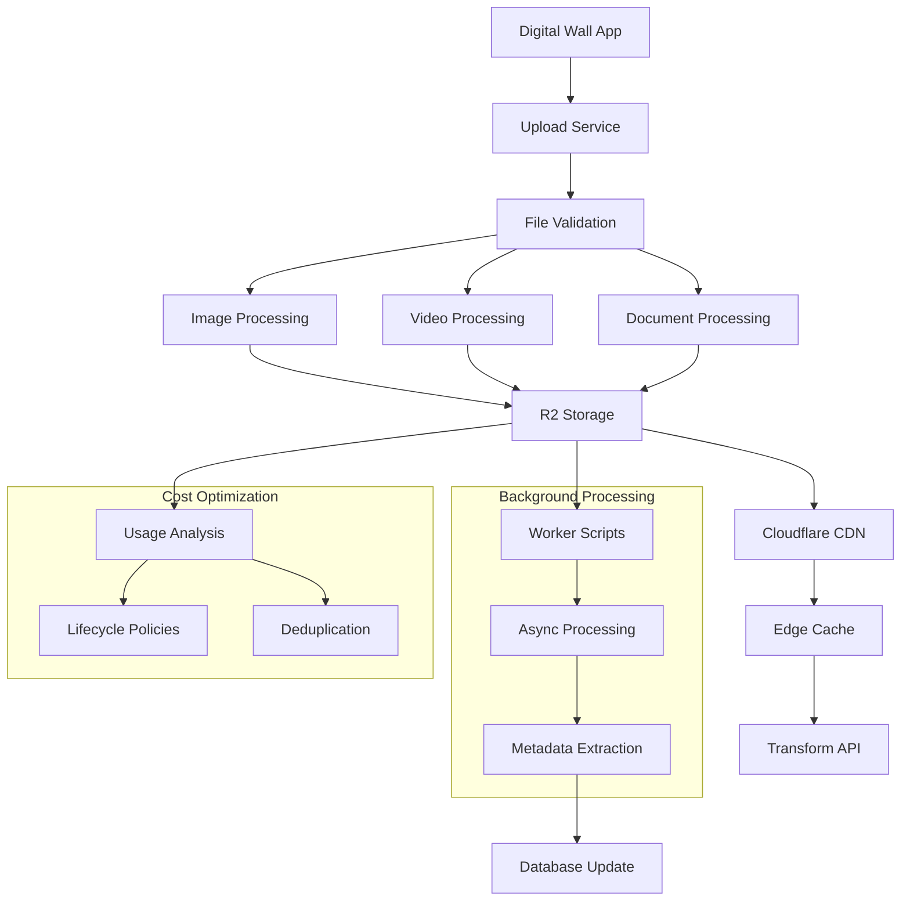

# [[Cloudflare R2 Storage]] - CDN Integration Patterns

## Overview & Core Concepts

**Cloudflare R2** provides zero-egress S3-compatible object storage optimized for the [[Digital Wall]] project's content curation needs. This document covers advanced R2 integration patterns, CDN optimization, and cost-effective storage strategies for user-generated content.

### Key Advantages for Digital Wall
- **[[Zero Egress Fees]]**: No charges for data retrieval via Cloudflare CDN
- **[[S3 Compatibility]]**: Drop-in replacement for AWS S3 APIs
- **[[Global CDN]]**: Automatic edge caching with 200+ locations
- **[[Transform API]]**: On-the-fly image processing and optimization
- **[[Workers Integration]]**: Serverless processing at the edge

## Technical Deep Dive

### R2 Bucket Configuration and Setup

```python
# app/core/r2_storage.py - R2 Storage configuration
import boto3
from botocore.config import Config
from typing import Optional, Dict, Any, BinaryIO
import mimetypes
import hashlib
import logging

from app.core.config import settings

logger = logging.getLogger(__name__)

class R2StorageClient:
    def __init__(self):
        self.client = boto3.client(
            's3',
            endpoint_url=settings.R2_ENDPOINT_URL,
            aws_access_key_id=settings.R2_ACCESS_KEY_ID,
            aws_secret_access_key=settings.R2_SECRET_ACCESS_KEY,
            region_name=settings.R2_REGION,
            config=Config(
                max_pool_connections=50,
                retries={'max_attempts': 3, 'mode': 'adaptive'},
                signature_version='s3v4'
            )
        )
        self.bucket = settings.R2_BUCKET_NAME
        self.cdn_url = settings.R2_CDN_URL
    
    async def upload_file(
        self,
        file_data: BinaryIO,
        file_name: str,
        content_type: Optional[str] = None,
        user_id: Optional[str] = None,
        metadata: Optional[Dict[str, str]] = None
    ) -> Dict[str, str]:
        """Upload file to R2 with optimized settings"""
        try:
            # Generate unique key with hash verification
            file_hash = await self._calculate_file_hash(file_data)
            file_extension = file_name.split('.')[-1] if '.' in file_name else ''
            
            # Organize by user and date for better performance
            from datetime import datetime
            date_prefix = datetime.now().strftime('%Y/%m/%d')
            user_prefix = f"users/{user_id}" if user_id else "anonymous"
            
            object_key = f"{user_prefix}/{date_prefix}/{file_hash}.{file_extension}"
            
            # Auto-detect content type
            if not content_type:
                content_type, _ = mimetypes.guess_type(file_name)
                content_type = content_type or 'application/octet-stream'
            
            # Prepare metadata
            upload_metadata = {
                'original-filename': file_name,
                'upload-timestamp': str(datetime.now().isoformat()),
                'file-hash': file_hash,
                'user-id': user_id or 'anonymous'
            }
            
            if metadata:
                upload_metadata.update(metadata)
            
            # Upload with optimized settings
            response = self.client.upload_fileobj(
                file_data,
                self.bucket,
                object_key,
                ExtraArgs={
                    'ContentType': content_type,
                    'Metadata': upload_metadata,
                    'CacheControl': self._get_cache_control(content_type),
                    'ACL': 'public-read'  # Public for CDN access
                }
            )
            
            # Generate CDN URLs
            cdn_url = f"{self.cdn_url}/{object_key}"
            direct_url = f"{settings.R2_ENDPOINT_URL}/{self.bucket}/{object_key}"
            
            logger.info(f"File uploaded successfully: {object_key}")
            
            return {
                'object_key': object_key,
                'cdn_url': cdn_url,
                'direct_url': direct_url,
                'file_hash': file_hash,
                'content_type': content_type,
                'size': file_data.tell()
            }
            
        except Exception as e:
            logger.error(f"R2 upload error: {e}")
            raise StorageError(f"File upload failed: {str(e)}")
    
    async def _calculate_file_hash(self, file_data: BinaryIO) -> str:
        """Calculate SHA-256 hash for file integrity"""
        file_data.seek(0)
        hash_sha256 = hashlib.sha256()
        
        for chunk in iter(lambda: file_data.read(4096), b""):
            hash_sha256.update(chunk)
        
        file_data.seek(0)  # Reset file pointer
        return hash_sha256.hexdigest()
    
    def _get_cache_control(self, content_type: str) -> str:
        """Get appropriate cache control headers"""
        if content_type.startswith('image/'):
            return 'public, max-age=31536000, immutable'  # 1 year for images
        elif content_type.startswith('video/'):
            return 'public, max-age=2592000'  # 30 days for videos
        elif content_type == 'application/pdf':
            return 'public, max-age=7776000'  # 90 days for PDFs
        else:
            return 'public, max-age=86400'  # 1 day for other files

class StorageError(Exception):
    pass
```

### Advanced Upload Patterns with Multipart

```python
# app/services/upload_service.py - Advanced upload handling
import asyncio
import aiofiles
from typing import List, AsyncGenerator
from fastapi import UploadFile
from concurrent.futures import ThreadPoolExecutor

class AdvancedUploadService:
    def __init__(self, r2_client: R2StorageClient):
        self.r2_client = r2_client
        self.executor = ThreadPoolExecutor(max_workers=10)
    
    async def upload_multiple_files(
        self,
        files: List[UploadFile],
        user_id: str,
        progress_callback: Optional[callable] = None
    ) -> List[Dict[str, Any]]:
        """Upload multiple files concurrently with progress tracking"""
        
        async def upload_single_file(file: UploadFile, index: int) -> Dict[str, Any]:
            try:
                # Validate file
                validation = await self._validate_file(file)
                if not validation['valid']:
                    return {
                        'filename': file.filename,
                        'status': 'error',
                        'error': validation['error']
                    }
                
                # Process and upload
                processed_file = await self._process_file(file)
                result = await self.r2_client.upload_file(
                    file_data=processed_file['data'],
                    file_name=file.filename,
                    content_type=file.content_type,
                    user_id=user_id,
                    metadata=processed_file['metadata']
                )
                
                if progress_callback:
                    await progress_callback(index + 1, len(files))
                
                return {
                    'filename': file.filename,
                    'status': 'success',
                    **result
                }
                
            except Exception as e:
                logger.error(f"Upload error for {file.filename}: {e}")
                return {
                    'filename': file.filename,
                    'status': 'error',
                    'error': str(e)
                }
        
        # Execute uploads concurrently with semaphore
        semaphore = asyncio.Semaphore(5)  # Limit concurrent uploads
        
        async def upload_with_semaphore(file: UploadFile, index: int):
            async with semaphore:
                return await upload_single_file(file, index)
        
        tasks = [
            upload_with_semaphore(file, i) 
            for i, file in enumerate(files)
        ]
        
        return await asyncio.gather(*tasks)
    
    async def _validate_file(self, file: UploadFile) -> Dict[str, Any]:
        """Validate uploaded file"""
        # Size limits
        MAX_FILE_SIZE = 50 * 1024 * 1024  # 50MB
        
        # Read file size
        content = await file.read()
        await file.seek(0)  # Reset for later reading
        
        if len(content) > MAX_FILE_SIZE:
            return {
                'valid': False,
                'error': f'File too large: {len(content)} bytes (max: {MAX_FILE_SIZE})'
            }
        
        # Content type validation
        allowed_types = {
            'image/jpeg', 'image/png', 'image/webp', 'image/gif',
            'video/mp4', 'video/webm', 'video/quicktime',
            'application/pdf', 'text/plain'
        }
        
        if file.content_type not in allowed_types:
            return {
                'valid': False,
                'error': f'Unsupported file type: {file.content_type}'
            }
        
        # File signature validation
        file_signature = content[:16]  # First 16 bytes
        if not self._validate_file_signature(file_signature, file.content_type):
            return {
                'valid': False,
                'error': 'File signature does not match content type'
            }
        
        return {'valid': True}
    
    async def _process_file(self, file: UploadFile) -> Dict[str, Any]:
        """Process file before upload (compression, metadata extraction)"""
        content = await file.read()
        await file.seek(0)
        
        metadata = {
            'original_size': str(len(content)),
            'upload_timestamp': str(datetime.now().isoformat())
        }
        
        # Image processing
        if file.content_type.startswith('image/'):
            processed_content, image_metadata = await self._process_image(content)
            metadata.update(image_metadata)
            
            return {
                'data': BytesIO(processed_content),
                'metadata': metadata
            }
        
        # Video processing
        elif file.content_type.startswith('video/'):
            # For large videos, we might want to process them asynchronously
            metadata['processing_status'] = 'pending'
            
            return {
                'data': BytesIO(content),
                'metadata': metadata
            }
        
        # Default processing
        return {
            'data': BytesIO(content),
            'metadata': metadata
        }
    
    async def _process_image(self, image_data: bytes) -> tuple[bytes, Dict[str, str]]:
        """Process image for optimization"""
        from PIL import Image
        import io
        
        try:
            # Load image
            image = Image.open(io.BytesIO(image_data))
            
            # Extract metadata
            metadata = {
                'width': str(image.width),
                'height': str(image.height),
                'format': image.format.lower(),
                'mode': image.mode
            }
            
            # Optimize image
            max_dimension = 2048
            if image.width > max_dimension or image.height > max_dimension:
                # Maintain aspect ratio
                ratio = min(max_dimension / image.width, max_dimension / image.height)
                new_size = (int(image.width * ratio), int(image.height * ratio))
                image = image.resize(new_size, Image.Resampling.LANCZOS)
                
                metadata['resized'] = 'true'
                metadata['new_width'] = str(image.width)
                metadata['new_height'] = str(image.height)
            
            # Convert to WebP for better compression
            output = io.BytesIO()
            image.save(output, format='WEBP', quality=85, optimize=True)
            output.seek(0)
            
            metadata['optimized'] = 'true'
            metadata['output_format'] = 'webp'
            
            return output.getvalue(), metadata
            
        except Exception as e:
            logger.warning(f"Image processing failed: {e}, using original")
            return image_data, {'processing_error': str(e)}
```

### CDN Integration with Transform API

```python
# app/services/cdn_service.py - CDN optimization service
from typing import Dict, Optional, List
from urllib.parse import urlencode
import hashlib

class CloudflareCDNService:
    def __init__(self, cdn_base_url: str):
        self.cdn_base_url = cdn_base_url.rstrip('/')
    
    def generate_optimized_url(
        self,
        object_key: str,
        transformations: Optional[Dict[str, Any]] = None,
        cache_buster: Optional[str] = None
    ) -> str:
        """Generate optimized CDN URL with transformations"""
        base_url = f"{self.cdn_base_url}/{object_key}"
        
        if not transformations and not cache_buster:
            return base_url
        
        params = {}
        
        # Add transformations
        if transformations:
            # Image transformations
            if 'width' in transformations:
                params['w'] = transformations['width']
            if 'height' in transformations:
                params['h'] = transformations['height']
            if 'quality' in transformations:
                params['q'] = transformations['quality']
            if 'format' in transformations:
                params['f'] = transformations['format']
            if 'fit' in transformations:
                params['fit'] = transformations['fit']  # crop, contain, cover
        
        # Cache buster for dynamic content
        if cache_buster:
            params['v'] = cache_buster
        
        if params:
            return f"{base_url}?{urlencode(params)}"
        
        return base_url
    
    def generate_responsive_urls(
        self,
        object_key: str,
        breakpoints: List[int] = None
    ) -> Dict[str, str]:
        """Generate responsive image URLs for different screen sizes"""
        if not breakpoints:
            breakpoints = [320, 640, 768, 1024, 1280, 1920]
        
        responsive_urls = {}
        
        for width in breakpoints:
            key = f"{width}w"
            responsive_urls[key] = self.generate_optimized_url(
                object_key,
                {
                    'width': width,
                    'quality': 85,
                    'format': 'webp',
                    'fit': 'cover'
                }
            )
        
        return responsive_urls
    
    def generate_srcset(
        self,
        object_key: str,
        breakpoints: List[int] = None
    ) -> str:
        """Generate HTML srcset attribute for responsive images"""
        responsive_urls = self.generate_responsive_urls(object_key, breakpoints)
        
        srcset_parts = []
        for size_key, url in responsive_urls.items():
            width = size_key.replace('w', '')
            srcset_parts.append(f"{url} {width}w")
        
        return ", ".join(srcset_parts)
    
    def get_video_poster(self, video_object_key: str, timestamp: float = 1.0) -> str:
        """Generate video poster thumbnail URL"""
        return self.generate_optimized_url(
            video_object_key,
            {
                'format': 'webp',
                'width': 1280,
                'quality': 80,
                'timestamp': timestamp  # Seconds into video
            }
        )
```

## Development Patterns

### Worker Integration for Background Processing

```python
# app/workers/storage_worker.py - Cloudflare Workers integration
from typing import Dict, Any
import aiohttp
import json

class CloudflareWorkerService:
    def __init__(self):
        self.worker_base_url = settings.CLOUDFLARE_WORKER_URL
        self.auth_token = settings.CLOUDFLARE_WORKER_AUTH_TOKEN
    
    async def process_media_async(
        self,
        object_key: str,
        processing_type: str,
        parameters: Dict[str, Any]
    ) -> Dict[str, Any]:
        """Trigger async media processing via Cloudflare Worker"""
        
        payload = {
            'object_key': object_key,
            'processing_type': processing_type,
            'parameters': parameters,
            'callback_url': f"{settings.API_BASE_URL}/api/v1/storage/processing-complete"
        }
        
        headers = {
            'Authorization': f'Bearer {self.auth_token}',
            'Content-Type': 'application/json'
        }
        
        async with aiohttp.ClientSession() as session:
            async with session.post(
                f"{self.worker_base_url}/process-media",
                json=payload,
                headers=headers,
                timeout=30
            ) as response:
                
                if response.status != 200:
                    raise WorkerError(
                        f"Worker processing failed: {response.status}"
                    )
                
                return await response.json()

# Cloudflare Worker script (JavaScript)
"""
// worker.js - Cloudflare Worker for R2 processing
addEventListener('fetch', event => {
  event.respondWith(handleRequest(event.request))
})

async function handleRequest(request) {
  if (request.method === 'POST') {
    return await processMediaRequest(request)
  }
  
  return new Response('Method not allowed', { status: 405 })
}

async function processMediaRequest(request) {
  try {
    const { object_key, processing_type, parameters, callback_url } = await request.json()
    
    // Get object from R2
    const object = await R2_BUCKET.get(object_key)
    if (!object) {
      return new Response('Object not found', { status: 404 })
    }
    
    let processedData
    
    switch (processing_type) {
      case 'image_optimization':
        processedData = await optimizeImage(object, parameters)
        break
      case 'video_thumbnail':
        processedData = await generateVideoThumbnail(object, parameters)
        break
      case 'metadata_extraction':
        processedData = await extractMetadata(object, parameters)
        break
      default:
        return new Response('Unknown processing type', { status: 400 })
    }
    
    // Store processed result
    const resultKey = `processed/${Date.now()}-${object_key}`
    await R2_BUCKET.put(resultKey, processedData)
    
    // Notify callback
    if (callback_url) {
      await fetch(callback_url, {
        method: 'POST',
        headers: { 'Content-Type': 'application/json' },
        body: JSON.stringify({
          original_key: object_key,
          processed_key: resultKey,
          processing_type,
          status: 'completed'
        })
      })
    }
    
    return new Response(JSON.stringify({
      status: 'success',
      processed_key: resultKey
    }), {
      headers: { 'Content-Type': 'application/json' }
    })
    
  } catch (error) {
    return new Response(JSON.stringify({
      status: 'error',
      error: error.message
    }), {
      status: 500,
      headers: { 'Content-Type': 'application/json' }
    })
  }
}

async function optimizeImage(imageObject, parameters) {
  // Use Cloudflare's image processing
  const imageData = await imageObject.arrayBuffer()
  
  // Transform parameters
  const options = {
    width: parameters.width || 1200,
    height: parameters.height,
    quality: parameters.quality || 85,
    format: parameters.format || 'webp'
  }
  
  // Process with Cloudflare Images
  const processed = await fetch('https://imagedelivery.net/transform', {
    method: 'POST',
    body: imageData,
    headers: {
      'Content-Type': 'image/jpeg',
      'CF-Transform': JSON.stringify(options)
    }
  })
  
  return await processed.arrayBuffer()
}
"""

class WorkerError(Exception):
    pass
```

### Smart Caching Strategy

```python
# app/services/cache_service.py - R2 caching optimization
import asyncio
from typing import Optional, Dict, Any
from datetime import datetime, timedelta
import json

class R2CacheService:
    def __init__(self, redis_client, r2_client: R2StorageClient):
        self.redis = redis_client
        self.r2_client = r2_client
    
    async def get_cached_url(
        self, 
        object_key: str,
        transformations: Optional[Dict[str, Any]] = None,
        cache_duration: int = 3600
    ) -> Optional[str]:
        """Get cached CDN URL or generate new one"""
        
        # Generate cache key
        cache_key = self._generate_cache_key(object_key, transformations)
        
        # Try to get from cache
        cached_url = await self.redis.get(cache_key)
        if cached_url:
            return cached_url.decode() if isinstance(cached_url, bytes) else cached_url
        
        # Generate new URL
        cdn_service = CloudflareCDNService(settings.R2_CDN_URL)
        url = cdn_service.generate_optimized_url(object_key, transformations)
        
        # Cache the URL
        await self.redis.setex(cache_key, cache_duration, url)
        
        return url
    
    async def preload_popular_content(self, popular_keys: List[str]):
        """Preload popular content to edge cache"""
        
        preload_tasks = []
        
        for object_key in popular_keys:
            # Common transformations to preload
            transformations_list = [
                {'width': 640, 'quality': 85, 'format': 'webp'},
                {'width': 1280, 'quality': 85, 'format': 'webp'},
                {'width': 320, 'quality': 75, 'format': 'webp'}
            ]
            
            for transformations in transformations_list:
                task = self._preload_single_url(object_key, transformations)
                preload_tasks.append(task)
        
        # Execute preloading concurrently
        await asyncio.gather(*preload_tasks, return_exceptions=True)
    
    async def _preload_single_url(
        self, 
        object_key: str, 
        transformations: Dict[str, Any]
    ):
        """Preload single URL variant"""
        try:
            cdn_service = CloudflareCDNService(settings.R2_CDN_URL)
            url = cdn_service.generate_optimized_url(object_key, transformations)
            
            # Make request to warm cache
            async with aiohttp.ClientSession() as session:
                async with session.head(url, timeout=10) as response:
                    logger.debug(f"Preloaded: {url} - Status: {response.status}")
                    
        except Exception as e:
            logger.warning(f"Preload failed for {object_key}: {e}")
    
    def _generate_cache_key(
        self, 
        object_key: str, 
        transformations: Optional[Dict[str, Any]]
    ) -> str:
        """Generate cache key for URL"""
        base_key = f"cdn_url:{object_key}"
        
        if transformations:
            # Sort transformations for consistent cache keys
            sorted_params = sorted(transformations.items())
            params_str = ":".join([f"{k}={v}" for k, v in sorted_params])
            return f"{base_key}:{params_str}"
        
        return base_key
    
    async def invalidate_cache(self, object_key: str):
        """Invalidate all cached URLs for an object"""
        pattern = f"cdn_url:{object_key}*"
        
        # Get all matching keys
        keys = await self.redis.keys(pattern)
        
        if keys:
            await self.redis.delete(*keys)
            logger.info(f"Invalidated {len(keys)} cache entries for {object_key}")
```

## Production Considerations

### Cost Optimization Strategies

```python
# app/services/cost_optimizer.py - R2 cost optimization
from datetime import datetime, timedelta
from typing import List, Dict, Any
import logging

class R2CostOptimizer:
    def __init__(self, r2_client: R2StorageClient):
        self.r2_client = r2_client
    
    async def analyze_storage_usage(self, days: int = 30) -> Dict[str, Any]:
        """Analyze storage usage patterns for cost optimization"""
        
        # Get usage data from the last N days
        end_date = datetime.now()
        start_date = end_date - timedelta(days=days)
        
        analysis = {
            'total_objects': 0,
            'total_size_gb': 0,
            'storage_classes': {},
            'access_patterns': {},
            'recommendations': []
        }
        
        # Analyze object access patterns
        paginator = self.r2_client.client.get_paginator('list_objects_v2')
        page_iterator = paginator.paginate(Bucket=self.r2_client.bucket)
        
        for page in page_iterator:
            if 'Contents' in page:
                for obj in page['Contents']:
                    analysis['total_objects'] += 1
                    analysis['total_size_gb'] += obj['Size'] / (1024**3)
                    
                    # Check last access time
                    last_modified = obj['LastModified']
                    age_days = (end_date - last_modified.replace(tzinfo=None)).days
                    
                    if age_days > 90:
                        analysis['access_patterns']['cold'] = \
                            analysis['access_patterns'].get('cold', 0) + 1
                    elif age_days > 30:
                        analysis['access_patterns']['warm'] = \
                            analysis['access_patterns'].get('warm', 0) + 1
                    else:
                        analysis['access_patterns']['hot'] = \
                            analysis['access_patterns'].get('hot', 0) + 1
        
        # Generate recommendations
        cold_objects = analysis['access_patterns'].get('cold', 0)
        total_objects = analysis['total_objects']
        
        if cold_objects > 0:
            cold_percentage = (cold_objects / total_objects) * 100
            analysis['recommendations'].append({
                'type': 'lifecycle_policy',
                'description': f'{cold_percentage:.1f}% of objects are cold (90+ days old)',
                'action': 'Consider implementing lifecycle policies to move old objects to cheaper storage'
            })
        
        # Check for duplicate files
        duplicates = await self._find_duplicate_files()
        if duplicates:
            analysis['recommendations'].append({
                'type': 'deduplication',
                'description': f'Found {len(duplicates)} potential duplicate files',
                'action': 'Implement deduplication to reduce storage costs',
                'potential_savings_gb': sum(d['size_gb'] for d in duplicates)
            })
        
        return analysis
    
    async def _find_duplicate_files(self) -> List[Dict[str, Any]]:
        """Find duplicate files by comparing file hashes"""
        hash_map = {}
        duplicates = []
        
        # This would be expensive for large buckets - implement sampling
        paginator = self.r2_client.client.get_paginator('list_objects_v2')
        page_iterator = paginator.paginate(
            Bucket=self.r2_client.bucket,
            MaxKeys=1000  # Sample for analysis
        )
        
        for page in page_iterator:
            if 'Contents' in page:
                for obj in page['Contents']:
                    # Get object metadata to check for hash
                    try:
                        metadata = self.r2_client.client.head_object(
                            Bucket=self.r2_client.bucket,
                            Key=obj['Key']
                        )
                        
                        file_hash = metadata.get('Metadata', {}).get('file-hash')
                        if file_hash:
                            if file_hash in hash_map:
                                # Duplicate found
                                duplicates.append({
                                    'hash': file_hash,
                                    'original_key': hash_map[file_hash]['key'],
                                    'duplicate_key': obj['Key'],
                                    'size_gb': obj['Size'] / (1024**3)
                                })
                            else:
                                hash_map[file_hash] = {
                                    'key': obj['Key'],
                                    'size': obj['Size']
                                }
                                
                    except Exception as e:
                        logger.warning(f"Error checking object {obj['Key']}: {e}")
        
        return duplicates
    
    async def implement_lifecycle_policy(self):
        """Implement intelligent lifecycle policies"""
        lifecycle_config = {
            'Rules': [
                {
                    'ID': 'digital-wall-lifecycle',
                    'Status': 'Enabled',
                    'Filter': {'Prefix': 'users/'},
                    'Transitions': [
                        {
                            'Days': 90,
                            'StorageClass': 'GLACIER'
                        },
                        {
                            'Days': 365,
                            'StorageClass': 'DEEP_ARCHIVE'
                        }
                    ],
                    'AbortIncompleteMultipartUpload': {
                        'DaysAfterInitiation': 7
                    }
                }
            ]
        }
        
        try:
            self.r2_client.client.put_bucket_lifecycle_configuration(
                Bucket=self.r2_client.bucket,
                LifecycleConfiguration=lifecycle_config
            )
            
            logger.info("Lifecycle policy implemented successfully")
            
        except Exception as e:
            logger.error(f"Failed to implement lifecycle policy: {e}")
```

## Integration Examples

### Complete R2 Storage Architecture



### Integration with [[Digital Wall]] Components

- **[[FastAPI Async Architecture]]**: Async upload and processing endpoints
- **[[Next.js 14 PWA Patterns]]**: Frontend file upload and display components  
- **[[Content Processing Pipeline]]**: Background file processing workflows
- **[[Claude Sonnet 4 Integration]]**: AI-powered content analysis of stored files

## References & Further Reading

### Official Documentation
- [Cloudflare R2 Documentation](https://developers.cloudflare.com/r2/)
- [R2 API Reference](https://developers.cloudflare.com/r2/api/)
- [Cloudflare Workers](https://developers.cloudflare.com/workers/)
- [Transform API](https://developers.cloudflare.com/images/)

### Best Practices
- [R2 Performance Guide](https://developers.cloudflare.com/r2/learning/performance/)
- [CDN Optimization](https://developers.cloudflare.com/cache/)

### Related [[Vault]] Concepts
- [[Object Storage]] - Cloud storage fundamentals
- [[CDN Optimization]] - Content delivery best practices
- [[Image Processing]] - Media optimization techniques
- [[Cost Optimization]] - Cloud cost management strategies
- [[Edge Computing]] - Edge processing patterns

#digital-wall #research #cloudflare #r2 #storage #cdn