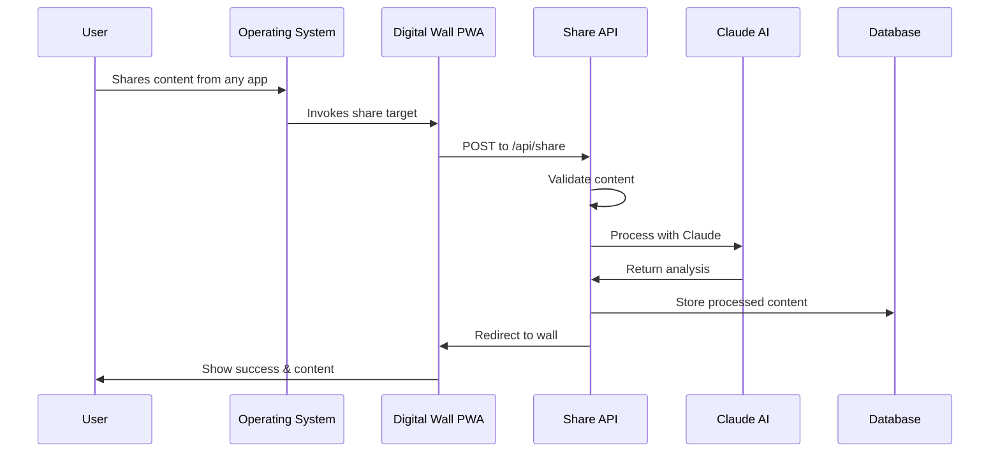

# [[PWA Share Target API]] - Digital Wall Implementation

## Overview & Core Concepts

The **PWA Share Target API** enables [[Progressive Web Apps]] to register as a destination for content sharing from the native operating system. For the [[Digital Wall]] project, this API is fundamental to achieving seamless integration with native share menus across platforms.

### Key Components
- **[[Web App Manifest]]**: Declares share target capabilities
- **[[Service Worker]]**: Handles share requests and processes shared content
- **[[Share Target Handler]]**: Processes incoming shared content
- **[[Content Type Detection]]**: Identifies and categorizes shared content

## Technical Deep Dive

### Web App Manifest Configuration

```json
{
  "name": "Digital Wall",
  "short_name": "DigitalWall",
  "start_url": "/",
  "display": "standalone",
  "share_target": {
    "action": "/api/share",
    "method": "POST",
    "enctype": "multipart/form-data",
    "params": {
      "title": "title",
      "text": "text",
      "url": "url",
      "files": [
        {
          "name": "files",
          "accept": ["image/*", "video/*", "audio/*", ".pdf"]
        }
      ]
    }
  }
}
```

### Share Handler Implementation

```typescript
// app/api/share/route.ts - Next.js 14 App Router
import { NextRequest } from 'next/server';
import { ContentProcessor } from '@/lib/content-processor';
import { WallStorage } from '@/lib/wall-storage';

export async function POST(request: NextRequest) {
  try {
    const formData = await request.formData();
    
    const shareData = {
      title: formData.get('title') as string || '',
      text: formData.get('text') as string || '',
      url: formData.get('url') as string || '',
      files: formData.getAll('files') as File[]
    };

    // Process shared content with AI
    const processedContent = await ContentProcessor.analyze(shareData);
    
    // Store to user's wall
    const wallItem = await WallStorage.add({
      ...processedContent,
      timestamp: new Date().toISOString(),
      source: 'share_api'
    });

    // Redirect to wall with success indicator
    return Response.redirect('/wall?share=success', 302);
    
  } catch (error) {
    console.error('Share processing error:', error);
    return Response.redirect('/wall?share=error', 302);
  }
}
```

### Service Worker Share Enhancement

```javascript
// public/sw.js - Enhanced share handling
self.addEventListener('fetch', event => {
  if (event.request.url.includes('/api/share')) {
    event.respondWith(
      (async () => {
        try {
          // Clone request for processing
          const request = event.request.clone();
          const formData = await request.formData();
          
          // Pre-process for better UX
          const preprocessed = await preprocessShareData(formData);
          
          // Forward to API with enhancements
          return fetch(event.request.url, {
            method: 'POST',
            body: preprocessed
          });
          
        } catch (error) {
          // Fallback handling
          return new Response('Share processing failed', { status: 500 });
        }
      })()
    );
  }
});

async function preprocessShareData(formData) {
  // Extract URL metadata if available
  const url = formData.get('url');
  if (url) {
    try {
      const metadata = await extractUrlMetadata(url);
      formData.set('extracted_metadata', JSON.stringify(metadata));
    } catch (e) {
      // Silent fail for metadata extraction
    }
  }
  
  return formData;
}
```

## Development Patterns

### Content Type Detection Strategy

```typescript
interface ShareContent {
  type: 'url' | 'text' | 'image' | 'video' | 'file';
  primaryContent: string | File;
  metadata?: Record<string, any>;
}

class ShareContentAnalyzer {
  static analyze(shareData: FormData): ShareContent {
    const files = shareData.getAll('files') as File[];
    const url = shareData.get('url') as string;
    const text = shareData.get('text') as string;
    
    // Priority: Files > URLs > Text
    if (files.length > 0) {
      const file = files[0];
      return {
        type: this.getFileType(file),
        primaryContent: file,
        metadata: {
          filename: file.name,
          size: file.size,
          lastModified: file.lastModified
        }
      };
    }
    
    if (url && this.isValidUrl(url)) {
      return {
        type: 'url',
        primaryContent: url,
        metadata: {
          domain: new URL(url).hostname,
          title: shareData.get('title') as string
        }
      };
    }
    
    if (text) {
      return {
        type: 'text',
        primaryContent: text,
        metadata: {
          length: text.length,
          title: shareData.get('title') as string
        }
      };
    }
    
    throw new Error('No valid content found in share data');
  }
  
  private static getFileType(file: File): 'image' | 'video' | 'file' {
    if (file.type.startsWith('image/')) return 'image';
    if (file.type.startsWith('video/')) return 'video';
    return 'file';
  }
  
  private static isValidUrl(url: string): boolean {
    try {
      new URL(url);
      return true;
    } catch {
      return false;
    }
  }
}
```

### Error Handling and Fallbacks

```typescript
// Robust share processing with fallbacks
export class ShareTargetProcessor {
  async processShare(formData: FormData): Promise<ProcessedShare> {
    const shareContent = ShareContentAnalyzer.analyze(formData);
    
    try {
      // Attempt AI processing
      const aiResult = await this.processWithAI(shareContent);
      return aiResult;
    } catch (aiError) {
      console.warn('AI processing failed, falling back to basic processing');
      
      // Fallback to basic processing
      return this.processBasic(shareContent);
    }
  }
  
  private async processWithAI(content: ShareContent): Promise<ProcessedShare> {
    // Implementation connects to [[Claude Sonnet 4 Integration]]
    const response = await fetch('/api/ai/process', {
      method: 'POST',
      headers: { 'Content-Type': 'application/json' },
      body: JSON.stringify(content)
    });
    
    if (!response.ok) {
      throw new Error(`AI processing failed: ${response.status}`);
    }
    
    return response.json();
  }
  
  private processBasic(content: ShareContent): ProcessedShare {
    // Basic processing without AI
    return {
      type: content.type,
      content: content.primaryContent,
      title: content.metadata?.title || 'Shared Content',
      description: this.generateBasicDescription(content),
      tags: ['shared'],
      timestamp: new Date().toISOString()
    };
  }
}
```

## Production Considerations

### Performance Optimization

```typescript
// Optimized share handling for production
export class OptimizedShareHandler {
  private static readonly MAX_FILE_SIZE = 10 * 1024 * 1024; // 10MB
  private static readonly SUPPORTED_TYPES = [
    'image/jpeg', 'image/png', 'image/webp',
    'video/mp4', 'video/webm',
    'application/pdf'
  ];
  
  async validateShare(formData: FormData): Promise<ValidationResult> {
    const files = formData.getAll('files') as File[];
    
    for (const file of files) {
      // Size validation
      if (file.size > this.MAX_FILE_SIZE) {
        return { 
          valid: false, 
          error: `File ${file.name} exceeds 10MB limit` 
        };
      }
      
      // Type validation
      if (!this.SUPPORTED_TYPES.includes(file.type)) {
        return { 
          valid: false, 
          error: `File type ${file.type} not supported` 
        };
      }
    }
    
    return { valid: true };
  }
  
  async processWithProgress(
    formData: FormData, 
    onProgress: (progress: number) => void
  ): Promise<ProcessedShare> {
    // Stream processing for large files
    const totalSteps = 4;
    let currentStep = 0;
    
    const updateProgress = () => {
      currentStep++;
      onProgress(currentStep / totalSteps);
    };
    
    // Step 1: Validation
    await this.validateShare(formData);
    updateProgress();
    
    // Step 2: Content analysis
    const content = ShareContentAnalyzer.analyze(formData);
    updateProgress();
    
    // Step 3: AI processing or fallback
    const processed = await this.processContent(content);
    updateProgress();
    
    // Step 4: Storage
    await this.storeProcessedContent(processed);
    updateProgress();
    
    return processed;
  }
}
```

### Installation Flow Integration

```typescript
// PWA installation detection and promotion
export class InstallationManager {
  private deferredPrompt: any = null;
  
  constructor() {
    window.addEventListener('beforeinstallprompt', (e) => {
      e.preventDefault();
      this.deferredPrompt = e;
      this.showInstallPromotion();
    });
  }
  
  private showInstallPromotion() {
    // Show custom install promotion for share functionality
    const installBanner = document.createElement('div');
    installBanner.innerHTML = `
      <div class="install-banner">
        <p>Install Digital Wall to share content directly from any app!</p>
        <button onclick="installApp()">Install</button>
        <button onclick="dismissInstall()">Not now</button>
      </div>
    `;
    
    document.body.appendChild(installBanner);
  }
  
  async promptInstall(): Promise<boolean> {
    if (!this.deferredPrompt) return false;
    
    this.deferredPrompt.prompt();
    const result = await this.deferredPrompt.userChoice;
    
    if (result.outcome === 'accepted') {
      this.trackInstallation('share_prompt');
      return true;
    }
    
    return false;
  }
  
  private trackInstallation(source: string) {
    // Analytics integration
    gtag('event', 'pwa_install', {
      source: source,
      timestamp: Date.now()
    });
  }
}
```

## Integration Examples

### Complete Share Flow Implementation



### Integration with [[Digital Wall]] Architecture

The PWA Share Target API connects to multiple [[Digital Wall]] components:

- **[[FastAPI Async Architecture]]**: Backend processing of shared content
- **[[Claude Sonnet 4 Integration]]**: AI analysis of shared items
- **[[Cloudflare R2 Storage]]**: Storage of shared files
- **[[Content Processing Pipeline]]**: Metadata extraction and enhancement
- **[[Next.js 14 PWA Patterns]]**: Frontend implementation patterns

### Testing Strategy

```typescript
// Test suite for share functionality
describe('PWA Share Target', () => {
  beforeEach(() => {
    // Mock service worker and APIs
    global.navigator.serviceWorker = mockServiceWorker();
  });
  
  test('processes URL shares correctly', async () => {
    const shareData = new FormData();
    shareData.set('url', 'https://example.com');
    shareData.set('title', 'Example Site');
    
    const result = await ShareTargetProcessor.processShare(shareData);
    
    expect(result.type).toBe('url');
    expect(result.metadata.domain).toBe('example.com');
  });
  
  test('handles file sharing with size limits', async () => {
    const largeFile = new File(['x'.repeat(11 * 1024 * 1024)], 'large.jpg');
    const shareData = new FormData();
    shareData.set('files', largeFile);
    
    await expect(
      ShareTargetProcessor.validateShare(shareData)
    ).rejects.toThrow('exceeds 10MB limit');
  });
  
  test('fallback processing when AI fails', async () => {
    // Mock AI failure
    jest.spyOn(global, 'fetch').mockRejectedValueOnce(new Error('AI unavailable'));
    
    const shareData = new FormData();
    shareData.set('text', 'Test content');
    
    const result = await ShareTargetProcessor.processShare(shareData);
    
    expect(result.title).toBe('Shared Content');
    expect(result.tags).toEqual(['shared']);
  });
});
```

## References & Further Reading

### Official Documentation
- [Web Share Target API - MDN](https://developer.mozilla.org/en-US/docs/Web/API/Web_Share_Target_API)
- [PWA Share Target - web.dev](https://web.dev/web-share-target/)
- [Service Worker API](https://developer.mozilla.org/en-US/docs/Web/API/Service_Worker_API)

### Implementation Guides  
- [Next.js PWA Configuration](https://nextjs.org/docs/pages/building-your-application/configuring/progressive-web-apps)
- [Share Target Best Practices](https://web.dev/share-target/)

### Related [[Vault]] Concepts
- [[Progressive Web Apps]] - Broader PWA architecture patterns
- [[Service Workers]] - Background processing capabilities  
- [[Web App Manifest]] - PWA configuration and capabilities
- [[Next.js 14 PWA Patterns]] - Framework-specific implementations
- [[Mobile Share Integration]] - Cross-platform sharing strategies

#digital-wall #research #pwa #share-target #web-apis