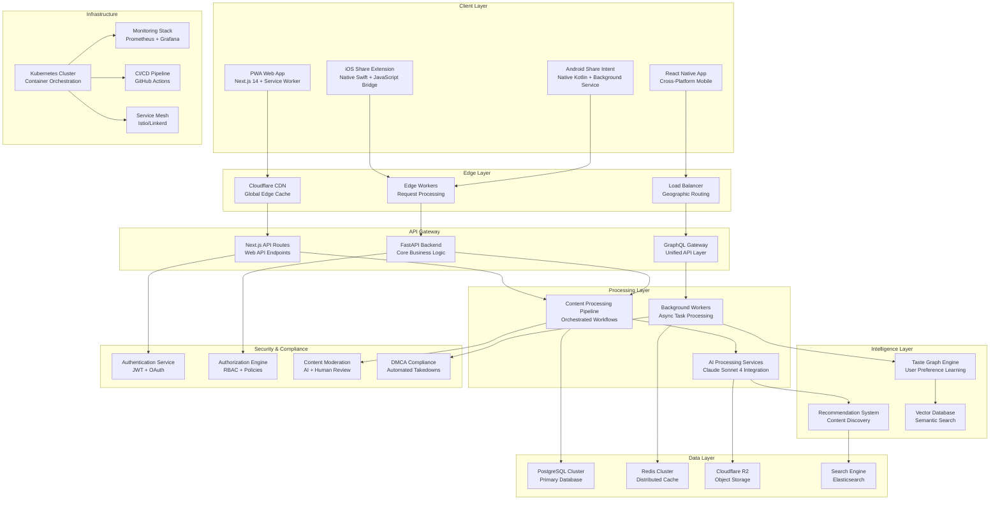
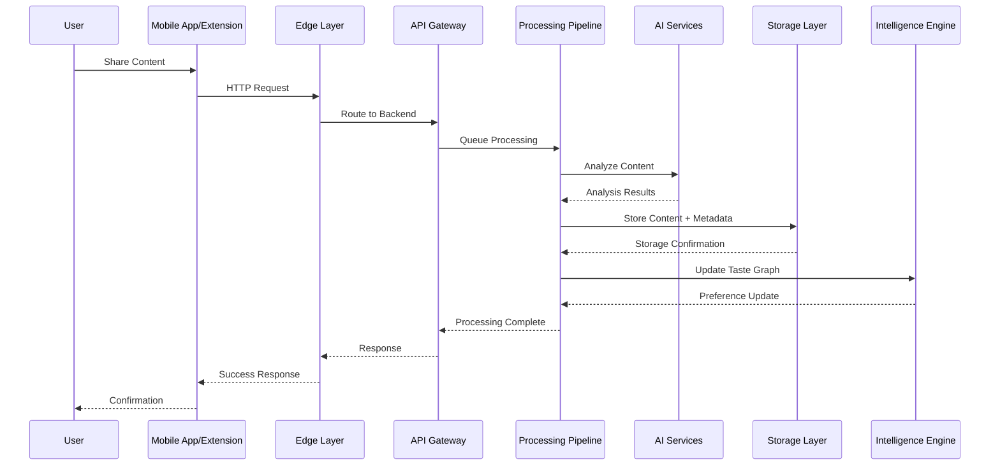
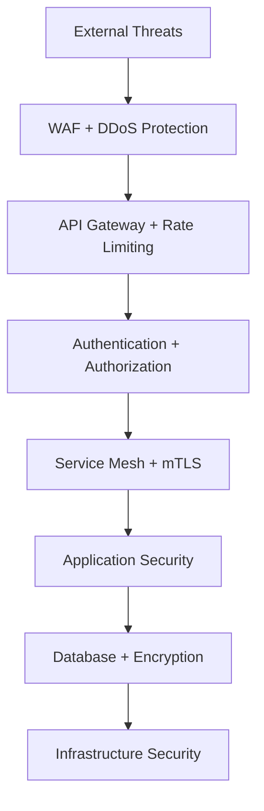
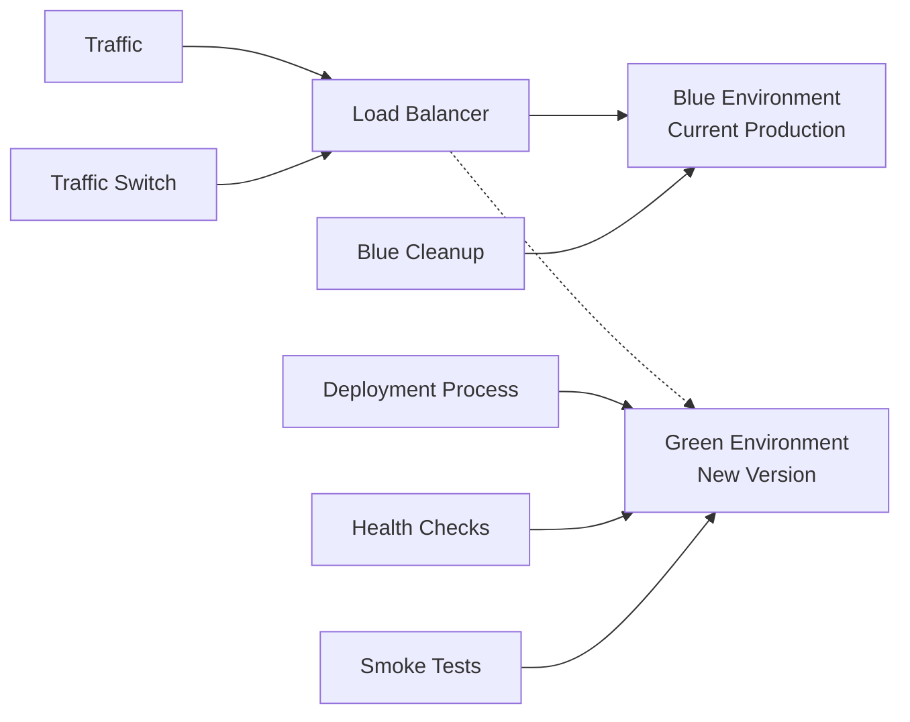
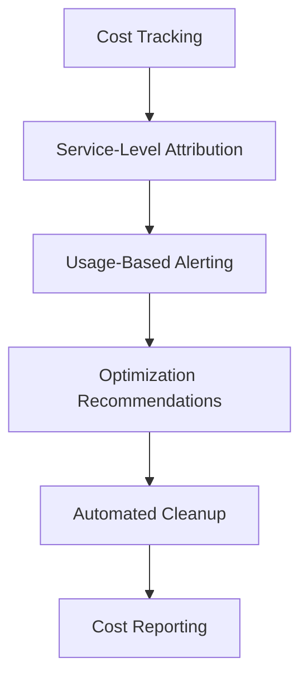

# Complete Technical Design

## System Overview

The **Digital Wall System Architecture** represents a comprehensive, scalable platform for content curation with native mobile sharing, AI-powered content understanding, and enterprise-grade infrastructure. This document provides the complete system design integrating all research components.

### Core System Principles
- **[[User-Centric Design]]**: Seamless sharing experience across all platforms
- **[[AI-First Architecture]]**: Intelligent content understanding and personalization
- **[[Cloud-Native Infrastructure]]**: Scalable, resilient, and cost-effective
- **[[Security by Design]]**: Comprehensive security and compliance integration
- **[[Performance Optimized]]**: Sub-2-second response times globally

## Complete System Architecture



## Component Integration Details

### Content Flow Architecture



### Data Architecture Patterns

#### Multi-Tier Storage Strategy
- **Hot Tier**: Redis Cache + R2 Standard (< 7 days, high access)
- **Warm Tier**: R2 Standard (7-30 days, moderate access)  
- **Cold Tier**: R2 Glacier (30-365 days, low access)
- **Archive Tier**: R2 Deep Archive (> 365 days, compliance)

#### Caching Strategy
- **L1 Cache**: Browser/App cache (static assets)
- **L2 Cache**: CDN edge cache (regional content)
- **L3 Cache**: Redis cluster (application data)
- **L4 Cache**: Database query cache (computed results)

#### Database Sharding
- **User Sharding**: Partition by user_id hash
- **Content Sharding**: Partition by content creation date
- **Analytics Sharding**: Partition by time-series buckets

## Performance Characteristics

### Latency Targets
- **Share Action**: < 500ms acknowledgment
- **Content Display**: < 2s page load globally
- **AI Processing**: < 30s background completion
- **Search Results**: < 200ms query response

### Throughput Capacity
- **Concurrent Users**: 100K+ active sessions
- **Share Requests**: 10K+ requests/second
- **Content Processing**: 1K+ items/second
- **Database Operations**: 50K+ queries/second

### Availability Targets
- **System Uptime**: 99.9% (< 9 hours downtime/year)
- **Regional Failover**: < 30 seconds
- **Data Durability**: 99.999999999% (11 9's)
- **Backup Recovery**: < 4 hours RTO, < 1 hour RPO

## Security Architecture

### Defense in Depth


### Compliance Framework
- **GDPR**: Data subject rights, consent management, data minimization
- **DMCA**: Copyright protection, takedown procedures, counter-notices
- **SOC 2**: Security controls, audit trails, incident response
- **CCPA**: Consumer privacy rights, data transparency, opt-out mechanisms

## Deployment Architecture

### Multi-Environment Strategy
```yaml
environments:
  development:
    replicas: 1
    resources: minimal
    data: synthetic
    monitoring: basic
    
  staging:
    replicas: 2
    resources: production-like
    data: anonymized-production
    monitoring: full
    
  production:
    replicas: 3+
    resources: auto-scaling
    data: live
    monitoring: comprehensive
    alerting: 24/7
```

### Blue-Green Deployment


## Monitoring & Observability

### Metrics Collection
- **Application Metrics**: Request rates, error rates, response times
- **Business Metrics**: Share success rates, content processing times
- **Infrastructure Metrics**: CPU, memory, disk, network utilization
- **User Metrics**: Session duration, feature usage, conversion rates

### Alerting Strategy
```yaml
alert_levels:
  critical:
    response_time: "immediate"
    escalation: "15 minutes"
    examples: ["system down", "data loss", "security breach"]
    
  warning:
    response_time: "30 minutes"
    escalation: "2 hours"
    examples: ["high error rate", "performance degradation"]
    
  info:
    response_time: "next business day"
    examples: ["capacity warnings", "optimization opportunities"]
```

## Disaster Recovery

### Backup Strategy
- **Database**: Continuous WAL shipping + hourly snapshots
- **Object Storage**: Cross-region replication + versioning
- **Application State**: Redis cluster backup every 6 hours
- **Configuration**: Git-based infrastructure as code

### Recovery Procedures
1. **Data Center Failure**: Automatic failover to secondary region (< 30s)
2. **Database Corruption**: Point-in-time recovery from backups (< 4 hours)
3. **Application Failure**: Rolling restart with health checks (< 5 minutes)
4. **Security Incident**: Automated isolation and forensic preservation

## Cost Optimization

### Resource Efficiency
- **Compute**: Kubernetes auto-scaling based on demand
- **Storage**: Automated tier transitions based on access patterns
- **Network**: CDN optimization reduces origin server load
- **Database**: Connection pooling and query optimization

### Cost Monitoring


## Future Architecture Evolution

### Scalability Roadmap
- **Phase 1**: Single-region deployment (MVP)
- **Phase 2**: Multi-region active-passive (Growth)
- **Phase 3**: Multi-region active-active (Scale)
- **Phase 4**: Edge computing integration (Global)

### Technology Evolution
- **AI Enhancement**: Custom model training, real-time inference
- **Mobile Expansion**: Native app development, offline capabilities
- **API Evolution**: GraphQL Federation, real-time subscriptions
- **Infrastructure**: Serverless migration, edge computing

## Integration with Research Components

### Core Technologies Integration
- **[[PWA Share Target API]]**: Client-side sharing implementation
- **[[Next.js 14 PWA Patterns]]**: Frontend architecture and optimization
- **[[FastAPI Async Architecture]]**: Backend services and API design
- **[[Cloudflare R2 Storage]]**: Object storage and CDN integration

### AI & Content Processing Integration
- **[[Claude Sonnet 4 Integration]]**: AI service integration patterns
- **[[Content Processing Pipeline]]**: Workflow orchestration
- **[[Taste Graph Algorithms]]**: Recommendation engine implementation

### Mobile Development Integration
- **[[iOS Share Extensions]]**: Native iOS sharing capabilities
- **[[Android Share Intents]]**: Native Android sharing capabilities
- **[[React Native Cross-Platform]]**: Unified mobile development

### Production & DevOps Integration
- **[[Digital Wall DevOps Pipeline]]**: CI/CD and deployment automation
- **[[Scalable Storage Architecture]]**: Storage optimization and management
- **[[Security & Compliance Framework]]**: Security and legal compliance

## Success Metrics

### Technical KPIs
- **Performance**: 95th percentile response time < 2s
- **Reliability**: 99.9% uptime with < 1 minute MTTR
- **Scalability**: Linear scaling to 1M+ users
- **Efficiency**: < $0.10 cost per active user per month

### Business KPIs
- **User Engagement**: 70%+ daily active users
- **Content Quality**: 85%+ AI analysis accuracy
- **Share Success**: 95%+ successful share completions
- **Recommendation Effectiveness**: 40%+ click-through rate

This comprehensive system architecture provides the technical foundation for implementing the Digital Wall platform as a scalable, intelligent, and secure content curation solution.

#digital-wall #research #system-architecture #scalability #performance #security