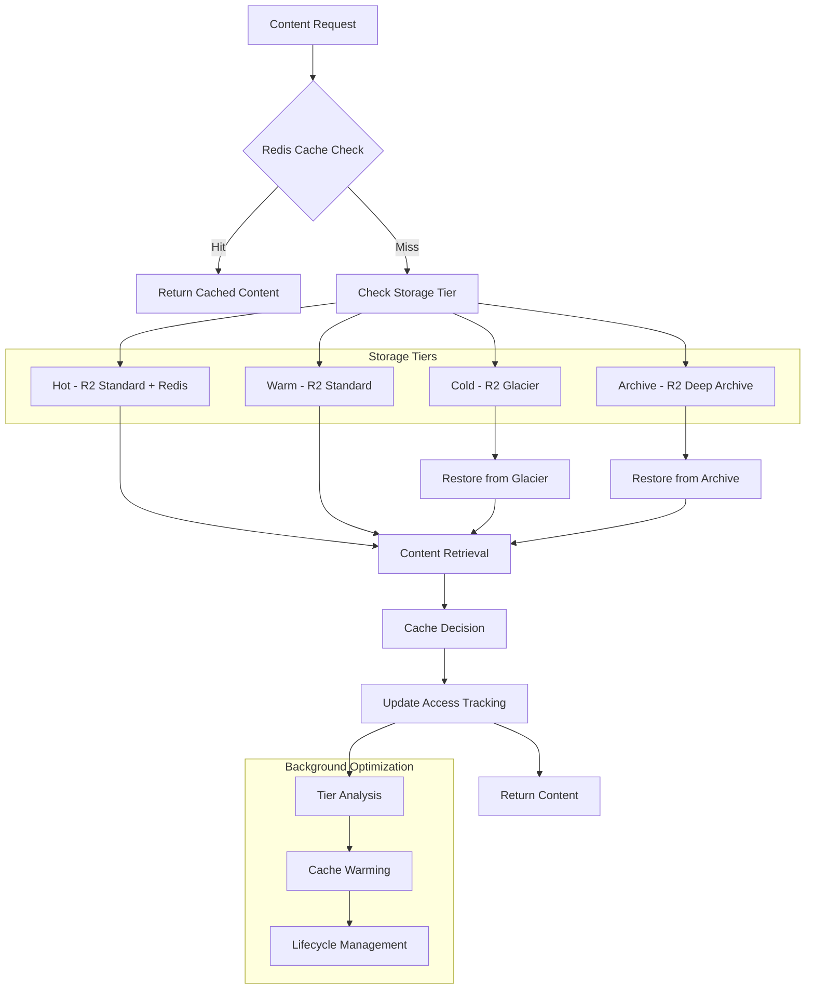

# [[Scalable Storage Architecture]] - R2-CDN-Redis Integration

## Overview & Core Concepts

The **Scalable Storage Architecture** orchestrates distributed storage, caching, and content delivery for the [[Digital Wall]] platform, ensuring optimal performance, cost-effectiveness, and global accessibility. This document covers advanced storage patterns, caching strategies, and CDN optimization.

### Architecture Components
- **[[Multi-Tier Storage]]**: Hot, warm, and cold storage optimization
- **[[Distributed Caching]]**: Redis clustering and cache invalidation
- **[[Global CDN]]**: Cloudflare edge distribution and optimization
- **[[Content Lifecycle]]**: Automated storage class transitions
- **[[Performance Optimization]]**: Cache warming and predictive loading

## Technical Implementation

### Storage Tier Architecture

```python
# app/services/storage_orchestrator.py - Storage tier management
import asyncio
from typing import Dict, Any, List, Optional
from enum import Enum
from datetime import datetime, timedelta

from app.core.config import settings
from app.services.r2_service import R2Service
from app.services.redis_service import RedisService
from app.services.database_service import DatabaseService

class StorageTier(Enum):
    HOT = "hot"        # Frequently accessed, Redis + R2 Standard
    WARM = "warm"      # Occasionally accessed, R2 Standard
    COLD = "cold"      # Rarely accessed, R2 Glacier
    ARCHIVE = "archive" # Long-term storage, R2 Deep Archive

class StorageOrchestrator:
    def __init__(self):
        self.r2_service = R2Service()
        self.redis_service = RedisService()
        self.db_service = DatabaseService()
        
        # Tier transition thresholds
        self.tier_config = {
            StorageTier.HOT: {
                'access_frequency': timedelta(days=7),
                'cache_ttl': 86400,  # 24 hours
                'prefetch_enabled': True
            },
            StorageTier.WARM: {
                'access_frequency': timedelta(days=30),
                'cache_ttl': 3600,   # 1 hour
                'prefetch_enabled': False
            },
            StorageTier.COLD: {
                'access_frequency': timedelta(days=365),
                'cache_ttl': 0,      # No caching
                'prefetch_enabled': False
            }
        }
    
    async def store_content(
        self,
        content_id: str,
        content_data: bytes,
        metadata: Dict[str, Any],
        initial_tier: StorageTier = StorageTier.HOT
    ) -> str:
        """Store content with intelligent tier placement"""
        
        try:
            # Store in primary storage (R2)
            object_key = await self.r2_service.upload_object(
                key=f"{initial_tier.value}/{content_id}",
                data=content_data,
                metadata={
                    **metadata,
                    'tier': initial_tier.value,
                    'created_at': datetime.now().isoformat(),
                    'access_count': '0',
                    'last_accessed': datetime.now().isoformat()
                }
            )
            
            # Cache in Redis if hot tier
            if initial_tier == StorageTier.HOT:
                await self.redis_service.cache_content(
                    content_id,
                    content_data,
                    ttl=self.tier_config[initial_tier]['cache_ttl']
                )
            
            # Store metadata in database
            await self.db_service.store_content_metadata(
                content_id=content_id,
                object_key=object_key,
                tier=initial_tier.value,
                size=len(content_data),
                metadata=metadata
            )
            
            return object_key
            
        except Exception as e:
            logger.error(f"Failed to store content {content_id}: {e}")
            raise StorageError(f"Storage operation failed: {str(e)}")
    
    async def retrieve_content(
        self,
        content_id: str,
        user_context: Optional[Dict[str, Any]] = None
    ) -> bytes:
        """Intelligent content retrieval with tier optimization"""
        
        # Check Redis cache first
        cached_content = await self.redis_service.get_cached_content(content_id)
        if cached_content:
            await self._track_access(content_id, hit_type='cache')
            return cached_content
        
        # Get content metadata from database
        content_meta = await self.db_service.get_content_metadata(content_id)
        if not content_meta:
            raise ContentNotFoundError(f"Content {content_id} not found")
        
        # Retrieve from R2 storage
        content_data = await self.r2_service.get_object(content_meta['object_key'])
        
        # Update access tracking
        await self._track_access(content_id, hit_type='storage')
        
        # Cache if accessed frequently
        if await self._should_cache(content_id, content_meta):
            await self.redis_service.cache_content(
                content_id,
                content_data,
                ttl=self._get_cache_ttl(content_meta['tier'])
            )
        
        # Prefetch related content if applicable
        if user_context and content_meta['tier'] == StorageTier.HOT.value:
            asyncio.create_task(
                self._prefetch_related_content(content_id, user_context)
            )
        
        return content_data
    
    async def optimize_storage_tiers(self) -> Dict[str, Any]:
        """Analyze and optimize content across storage tiers"""
        
        optimization_stats = {
            'transitions': 0,
            'cost_savings': 0.0,
            'performance_impact': 0.0
        }
        
        # Get all content for analysis
        all_content = await self.db_service.get_all_content_metadata()
        
        for content in all_content:
            current_tier = StorageTier(content['tier'])
            optimal_tier = await self._calculate_optimal_tier(content)
            
            if current_tier != optimal_tier:
                await self._transition_content(
                    content['content_id'],
                    current_tier,
                    optimal_tier
                )
                optimization_stats['transitions'] += 1
                optimization_stats['cost_savings'] += self._calculate_cost_saving(
                    current_tier, optimal_tier, content['size']
                )
        
        return optimization_stats
    
    async def _calculate_optimal_tier(
        self,
        content_meta: Dict[str, Any]
    ) -> StorageTier:
        """Calculate optimal storage tier based on access patterns"""
        
        content_id = content_meta['content_id']
        last_accessed = datetime.fromisoformat(content_meta['last_accessed'])
        access_count = content_meta['access_count']
        content_age = datetime.now() - datetime.fromisoformat(content_meta['created_at'])
        
        # Get recent access pattern
        recent_access_frequency = await self.db_service.get_access_frequency(
            content_id,
            window=timedelta(days=30)
        )
        
        # Calculate access velocity (accesses per day)
        access_velocity = recent_access_frequency / 30.0
        
        # Tier decision logic
        if access_velocity >= 1.0:  # 1+ access per day
            return StorageTier.HOT
        elif access_velocity >= 0.1:  # 3+ accesses per month
            return StorageTier.WARM
        elif content_age < timedelta(days=365):  # Less than 1 year old
            return StorageTier.WARM
        else:
            return StorageTier.COLD
    
    async def _transition_content(
        self,
        content_id: str,
        from_tier: StorageTier,
        to_tier: StorageTier
    ):
        """Transition content between storage tiers"""
        
        try:
            # Get current content
            content_meta = await self.db_service.get_content_metadata(content_id)
            content_data = await self.r2_service.get_object(content_meta['object_key'])
            
            # Upload to new tier location
            new_object_key = await self.r2_service.upload_object(
                key=f"{to_tier.value}/{content_id}",
                data=content_data,
                metadata={
                    **content_meta['metadata'],
                    'tier': to_tier.value,
                    'transitioned_at': datetime.now().isoformat(),
                    'previous_tier': from_tier.value
                },
                storage_class=self._get_r2_storage_class(to_tier)
            )
            
            # Update database
            await self.db_service.update_content_tier(
                content_id=content_id,
                new_tier=to_tier.value,
                new_object_key=new_object_key
            )
            
            # Handle cache implications
            if from_tier == StorageTier.HOT and to_tier != StorageTier.HOT:
                await self.redis_service.invalidate_cache(content_id)
            elif to_tier == StorageTier.HOT:
                await self.redis_service.cache_content(
                    content_id,
                    content_data,
                    ttl=self.tier_config[to_tier]['cache_ttl']
                )
            
            # Clean up old storage location
            await self.r2_service.delete_object(content_meta['object_key'])
            
            logger.info(f"Transitioned {content_id} from {from_tier.value} to {to_tier.value}")
            
        except Exception as e:
            logger.error(f"Failed to transition {content_id}: {e}")
            raise StorageError(f"Tier transition failed: {str(e)}")
```

### Distributed Redis Caching

```python
# app/services/redis_cluster_service.py - Redis clustering and caching
import asyncio
import json
import hashlib
from typing import Dict, Any, List, Optional, Union
from redis.asyncio import Redis, RedisCluster
from redis.asyncio.retry import Retry
from redis.asyncio.backoff import ExponentialBackoff

class RedisClusterService:
    def __init__(self):
        self.cluster = RedisCluster.from_url(
            settings.REDIS_CLUSTER_URL,
            decode_responses=False,
            retry=Retry(ExponentialBackoff(), 3),
            health_check_interval=30
        )
        
        # Cache configuration
        self.cache_config = {
            'content': {'ttl': 3600, 'max_size': 50 * 1024 * 1024},  # 50MB per item
            'metadata': {'ttl': 86400, 'max_size': 1024 * 1024},     # 1MB per item
            'user_preferences': {'ttl': 3600, 'max_size': 100 * 1024}, # 100KB per item
            'recommendations': {'ttl': 1800, 'max_size': 500 * 1024}   # 500KB per item
        }
    
    async def cache_content(
        self,
        content_id: str,
        content_data: bytes,
        ttl: Optional[int] = None,
        cache_type: str = 'content'
    ) -> bool:
        """Cache content with compression and sharding"""
        
        try:
            config = self.cache_config.get(cache_type, self.cache_config['content'])
            ttl = ttl or config['ttl']
            
            # Check size limits
            if len(content_data) > config['max_size']:
                logger.warning(f"Content {content_id} too large for caching: {len(content_data)} bytes")
                return False
            
            # Compress large content
            if len(content_data) > 1024 * 1024:  # 1MB threshold
                import gzip
                content_data = gzip.compress(content_data)
                compressed = True
            else:
                compressed = False
            
            # Generate cache key
            cache_key = self._generate_cache_key(content_id, cache_type)
            
            # Store with metadata
            cache_value = {
                'data': content_data,
                'compressed': compressed,
                'cached_at': datetime.now().isoformat(),
                'content_type': cache_type
            }
            
            # Atomic operation with pipeline
            pipeline = self.cluster.pipeline()
            pipeline.hset(cache_key, mapping={
                'data': content_data,
                'compressed': str(compressed).lower(),
                'cached_at': datetime.now().isoformat()
            })
            pipeline.expire(cache_key, ttl)
            await pipeline.execute()
            
            # Update cache statistics
            await self._update_cache_stats(cache_type, 'set', len(content_data))
            
            return True
            
        except Exception as e:
            logger.error(f"Failed to cache content {content_id}: {e}")
            return False
    
    async def get_cached_content(
        self,
        content_id: str,
        cache_type: str = 'content'
    ) -> Optional[bytes]:
        """Retrieve cached content with decompression"""
        
        try:
            cache_key = self._generate_cache_key(content_id, cache_type)
            
            # Get all hash fields
            cached_data = await self.cluster.hmget(
                cache_key,
                'data',
                'compressed',
                'cached_at'
            )
            
            if not cached_data[0]:  # No data found
                await self._update_cache_stats(cache_type, 'miss', 0)
                return None
            
            content_data = cached_data[0]
            compressed = cached_data[1] == b'true'
            
            # Decompress if necessary
            if compressed:
                import gzip
                content_data = gzip.decompress(content_data)
            
            # Update access tracking
            await self._update_cache_stats(cache_type, 'hit', len(content_data))
            
            return content_data
            
        except Exception as e:
            logger.error(f"Failed to retrieve cached content {content_id}: {e}")
            return None
    
    async def invalidate_cache(
        self,
        pattern: str,
        cache_type: Optional[str] = None
    ) -> int:
        """Invalidate cache entries matching pattern"""
        
        try:
            # Build search pattern
            if cache_type:
                search_pattern = f"{cache_type}:{pattern}"
            else:
                search_pattern = f"*:{pattern}"
            
            # Find matching keys across cluster
            invalidated_count = 0
            async for key in self.cluster.scan_iter(match=search_pattern):
                await self.cluster.delete(key)
                invalidated_count += 1
            
            logger.info(f"Invalidated {invalidated_count} cache entries for pattern: {pattern}")
            return invalidated_count
            
        except Exception as e:
            logger.error(f"Cache invalidation failed for pattern {pattern}: {e}")
            return 0
    
    async def warm_cache(
        self,
        content_predictions: List[Dict[str, Any]]
    ):
        """Proactively warm cache with predicted content"""
        
        warming_tasks = []
        
        for prediction in content_predictions:
            content_id = prediction['content_id']
            probability = prediction['access_probability']
            
            # Only warm cache for high-probability content
            if probability > 0.7:
                task = asyncio.create_task(
                    self._warm_single_content(content_id, prediction)
                )
                warming_tasks.append(task)
        
        # Execute warming tasks with concurrency limit
        semaphore = asyncio.Semaphore(10)
        
        async def warm_with_limit(task):
            async with semaphore:
                return await task
        
        limited_tasks = [warm_with_limit(task) for task in warming_tasks]
        results = await asyncio.gather(*limited_tasks, return_exceptions=True)
        
        successful_warmings = sum(1 for r in results if r is True)
        logger.info(f"Cache warming completed: {successful_warmings}/{len(warming_tasks)} successful")
    
    async def get_cache_statistics(self) -> Dict[str, Any]:
        """Get comprehensive cache statistics"""
        
        stats = {}
        
        for cache_type in self.cache_config.keys():
            type_stats = await self.cluster.hgetall(f"stats:{cache_type}")
            
            stats[cache_type] = {
                'hits': int(type_stats.get(b'hits', 0)),
                'misses': int(type_stats.get(b'misses', 0)),
                'sets': int(type_stats.get(b'sets', 0)),
                'total_size': int(type_stats.get(b'total_size', 0)),
                'avg_size': int(type_stats.get(b'avg_size', 0))
            }
            
            # Calculate hit ratio
            total_requests = stats[cache_type]['hits'] + stats[cache_type]['misses']
            if total_requests > 0:
                stats[cache_type]['hit_ratio'] = stats[cache_type]['hits'] / total_requests
            else:
                stats[cache_type]['hit_ratio'] = 0.0
        
        return stats
```

## Integration Examples

### Complete Storage Architecture



### Integration with [[Digital Wall]] Components

- **[[Cloudflare R2 Storage]]**: Object storage tier management and lifecycle policies
- **[[Content Processing Pipeline]]**: Storage tier assignment during content processing
- **[[Taste Graph Algorithms]]**: Predictive cache warming based on recommendations
- **[[Digital Wall DevOps Pipeline]]**: Monitoring and optimization automation

## References & Further Reading

### Storage and Caching
- [Redis Documentation](https://redis.io/docs/)
- [Cloudflare R2 Documentation](https://developers.cloudflare.com/r2/)
- [Storage Architecture Patterns](https://aws.amazon.com/architecture/storage/)

### Related [[Vault]] Concepts
- [[Distributed Systems]] - Distributed architecture patterns
- [[Caching Strategies]] - Cache design and optimization
- [[Storage Optimization]] - Cost and performance optimization
- [[CDN Architecture]] - Content delivery network design

#digital-wall #research #storage #caching #cdn #performance