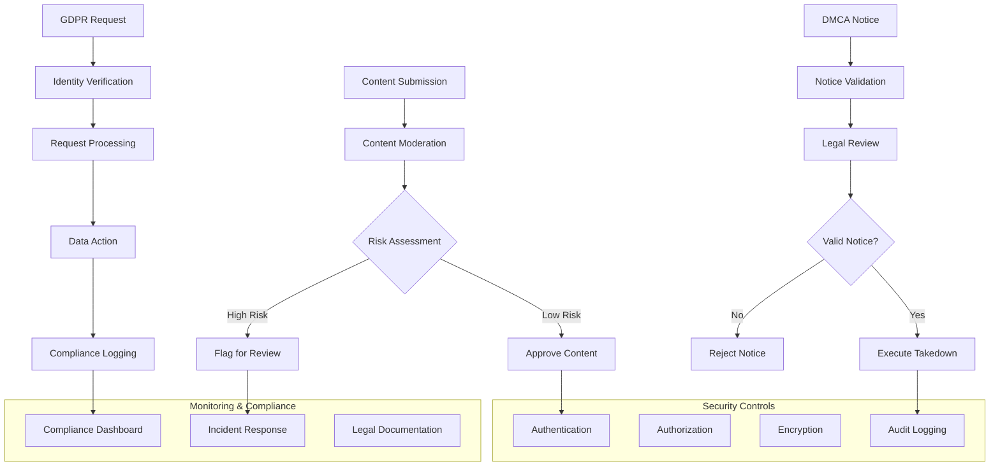

# [[Security & Compliance Framework]] - DMCA and Data Protection

## Overview & Core Concepts

The **Security & Compliance Framework** ensures the [[Digital Wall]] platform meets legal requirements, protects user data, and maintains content integrity through comprehensive security controls, privacy protection, and content moderation systems.

### Compliance Framework Components
- **[[DMCA Compliance]]**: Copyright protection and takedown procedures
- **[[GDPR/Privacy Protection]]**: User data rights and privacy controls
- **[[Content Moderation]]**: Automated and manual content review systems
- **[[Security Controls]]**: Authentication, authorization, and data protection
- **[[Audit & Monitoring]]**: Compliance tracking and incident response

## Technical Implementation

### DMCA Compliance System

```python
# app/services/dmca_service.py - DMCA compliance implementation
import asyncio
from typing import Dict, Any, List, Optional
from datetime import datetime, timedelta
from dataclasses import dataclass
from enum import Enum

@dataclass
class DMCANotice:
    id: str
    reporter_email: str
    reporter_name: str
    content_id: str
    content_url: str
    copyright_work_description: str
    infringement_description: str
    good_faith_statement: bool
    penalty_statement: bool
    signature: str
    submitted_at: datetime
    status: str = "pending"
    processed_at: Optional[datetime] = None

class DMCAStatus(Enum):
    PENDING = "pending"
    PROCESSING = "processing"
    VALID = "valid"
    INVALID = "invalid"
    COUNTER_NOTICE = "counter_notice"
    RESTORED = "restored"

class DMCAService:
    def __init__(self):
        self.notification_service = NotificationService()
        self.content_service = ContentService()
        self.legal_service = LegalService()
    
    async def submit_takedown_notice(
        self,
        notice_data: Dict[str, Any]
    ) -> DMCANotice:
        """Process DMCA takedown notice submission"""
        
        # Validate notice format
        validation_result = await self._validate_notice(notice_data)
        if not validation_result.is_valid:
            raise DMCAValidationError(validation_result.error_message)
        
        # Create DMCA notice record
        notice = DMCANotice(
            id=self._generate_notice_id(),
            reporter_email=notice_data['reporter_email'],
            reporter_name=notice_data['reporter_name'],
            content_id=notice_data['content_id'],
            content_url=notice_data['content_url'],
            copyright_work_description=notice_data['copyright_work_description'],
            infringement_description=notice_data['infringement_description'],
            good_faith_statement=notice_data['good_faith_statement'],
            penalty_statement=notice_data['penalty_statement'],
            signature=notice_data['signature'],
            submitted_at=datetime.now()
        )
        
        # Store notice
        await self._store_dmca_notice(notice)
        
        # Immediate content review
        await self._expedited_content_review(notice)
        
        # Notify stakeholders
        await self._notify_dmca_submission(notice)
        
        return notice
    
    async def process_takedown_notice(
        self,
        notice_id: str
    ) -> Dict[str, Any]:
        """Process DMCA takedown notice through review pipeline"""
        
        notice = await self._get_dmca_notice(notice_id)
        if not notice:
            raise DMCANoticeNotFoundError(f"Notice {notice_id} not found")
        
        try:
            notice.status = DMCAStatus.PROCESSING.value
            await self._update_dmca_notice(notice)
            
            # Step 1: Automated validation
            auto_validation = await self._automated_validation(notice)
            
            if auto_validation.requires_manual_review:
                # Step 2: Legal team review
                legal_review = await self._legal_team_review(notice)
                
                if legal_review.is_valid:
                    await self._execute_takedown(notice)
                    notice.status = DMCAStatus.VALID.value
                else:
                    await self._reject_notice(notice, legal_review.rejection_reason)
                    notice.status = DMCAStatus.INVALID.value
            else:
                if auto_validation.is_valid:
                    await self._execute_takedown(notice)
                    notice.status = DMCAStatus.VALID.value
                else:
                    await self._reject_notice(notice, auto_validation.rejection_reason)
                    notice.status = DMCAStatus.INVALID.value
            
            notice.processed_at = datetime.now()
            await self._update_dmca_notice(notice)
            
            # Generate compliance report
            return await self._generate_notice_report(notice)
            
        except Exception as e:
            logger.error(f"DMCA processing failed for {notice_id}: {e}")
            await self._handle_processing_error(notice, str(e))
            raise
    
    async def submit_counter_notice(
        self,
        original_notice_id: str,
        counter_notice_data: Dict[str, Any]
    ) -> str:
        """Process DMCA counter-notice"""
        
        original_notice = await self._get_dmca_notice(original_notice_id)
        if not original_notice or original_notice.status != DMCAStatus.VALID.value:
            raise DMCAError("Original notice not found or invalid")
        
        # Validate counter-notice
        counter_validation = await self._validate_counter_notice(counter_notice_data)
        if not counter_validation.is_valid:
            raise DMCAValidationError(counter_validation.error_message)
        
        # Create counter-notice record
        counter_notice_id = self._generate_notice_id()
        await self._store_counter_notice(counter_notice_id, original_notice_id, counter_notice_data)
        
        # Update original notice status
        original_notice.status = DMCAStatus.COUNTER_NOTICE.value
        await self._update_dmca_notice(original_notice)
        
        # Start 10-business-day waiting period
        await self._schedule_content_restoration(
            original_notice_id,
            delay_days=10
        )
        
        # Notify original reporter
        await self._notify_counter_notice(original_notice, counter_notice_id)
        
        return counter_notice_id
    
    async def _execute_takedown(self, notice: DMCANotice):
        """Execute content takedown with proper notification"""
        
        try:
            # Disable content access
            await self.content_service.disable_content(
                content_id=notice.content_id,
                reason="dmca_takedown",
                notice_id=notice.id
            )
            
            # Notify content owner
            content_owner = await self.content_service.get_content_owner(notice.content_id)
            await self.notification_service.send_takedown_notification(
                user_id=content_owner.user_id,
                notice_id=notice.id,
                content_id=notice.content_id
            )
            
            # Log compliance action
            await self._log_compliance_action(
                action="content_takedown",
                notice_id=notice.id,
                content_id=notice.content_id,
                reason="dmca_valid_notice"
            )
            
        except Exception as e:
            logger.error(f"Takedown execution failed for {notice.id}: {e}")
            raise DMCAExecutionError(f"Failed to execute takedown: {str(e)}")

class ContentModerationService:
    """Automated content moderation and safety checks"""
    
    def __init__(self):
        self.ai_moderation = AIModerationService()
        self.reputation_service = UserReputationService()
    
    async def moderate_content(
        self,
        content_id: str,
        content_data: Dict[str, Any]
    ) -> Dict[str, Any]:
        """Comprehensive content moderation"""
        
        moderation_result = {
            'content_id': content_id,
            'moderation_checks': {},
            'risk_score': 0.0,
            'action_required': False,
            'recommended_actions': []
        }
        
        # AI-based content analysis
        ai_result = await self.ai_moderation.analyze_content(content_data)
        moderation_result['moderation_checks']['ai_analysis'] = ai_result
        
        # Check for explicit content
        if ai_result.get('explicit_content', {}).get('probability', 0) > 0.8:
            moderation_result['risk_score'] += 0.4
            moderation_result['recommended_actions'].append('flag_explicit_content')
        
        # Check for copyright markers
        copyright_check = await self._check_copyright_markers(content_data)
        moderation_result['moderation_checks']['copyright'] = copyright_check
        
        if copyright_check.get('potential_infringement', False):
            moderation_result['risk_score'] += 0.3
            moderation_result['recommended_actions'].append('copyright_review')
        
        # User reputation check
        user_id = content_data.get('user_id')
        if user_id:
            reputation = await self.reputation_service.get_user_reputation(user_id)
            moderation_result['moderation_checks']['user_reputation'] = reputation
            
            if reputation.get('risk_level', 'low') == 'high':
                moderation_result['risk_score'] += 0.2
                moderation_result['recommended_actions'].append('enhanced_review')
        
        # URL safety check
        if content_data.get('url'):
            url_safety = await self._check_url_safety(content_data['url'])
            moderation_result['moderation_checks']['url_safety'] = url_safety
            
            if not url_safety.get('safe', True):
                moderation_result['risk_score'] += 0.5
                moderation_result['recommended_actions'].append('block_malicious_url')
        
        # Determine action required
        moderation_result['action_required'] = moderation_result['risk_score'] > 0.7
        
        return moderation_result

class GDPRComplianceService:
    """GDPR and privacy compliance management"""
    
    async def process_data_subject_request(
        self,
        request_type: str,
        user_email: str,
        request_details: Dict[str, Any]
    ) -> str:
        """Process GDPR data subject requests"""
        
        request_id = self._generate_request_id()
        
        try:
            # Verify user identity
            user = await self._verify_user_identity(user_email, request_details)
            if not user:
                raise GDPRError("User identity verification failed")
            
            # Process based on request type
            if request_type == "access":
                await self._process_data_access_request(request_id, user)
            elif request_type == "deletion":
                await self._process_data_deletion_request(request_id, user)
            elif request_type == "portability":
                await self._process_data_portability_request(request_id, user)
            elif request_type == "rectification":
                await self._process_data_rectification_request(request_id, user, request_details)
            else:
                raise GDPRError(f"Unsupported request type: {request_type}")
            
            # Log compliance activity
            await self._log_gdpr_request(request_id, request_type, user.user_id)
            
            return request_id
            
        except Exception as e:
            logger.error(f"GDPR request processing failed: {e}")
            await self._log_gdpr_error(request_id, str(e))
            raise
    
    async def _process_data_deletion_request(
        self,
        request_id: str,
        user: Dict[str, Any]
    ):
        """Process right to erasure request"""
        
        user_id = user['user_id']
        
        # Get all user data
        user_data_inventory = await self._get_user_data_inventory(user_id)
        
        deletion_tasks = [
            self._delete_user_profile(user_id),
            self._delete_user_content(user_id),
            self._delete_user_preferences(user_id),
            self._delete_user_analytics(user_id),
            self._anonymize_user_logs(user_id)
        ]
        
        # Execute deletion tasks
        results = await asyncio.gather(*deletion_tasks, return_exceptions=True)
        
        # Verify deletion completion
        verification = await self._verify_data_deletion(user_id)
        
        # Generate deletion certificate
        await self._generate_deletion_certificate(request_id, user_id, verification)
```

## Integration Examples

### Complete Security & Compliance Architecture



### Integration with [[Digital Wall]] Components

- **[[Content Processing Pipeline]]**: Automated moderation during content processing
- **[[Digital Wall DevOps Pipeline]]**: Security scanning and compliance validation
- **[[Scalable Storage Architecture]]**: Secure data handling and retention policies
- **[[FastAPI Async Architecture]]**: Security middleware and audit logging

## References & Further Reading

### Legal and Compliance
- [DMCA Guidelines](https://www.copyright.gov/dmca/)
- [GDPR Compliance Guide](https://gdpr.eu/)
- [Content Moderation Best Practices](https://www.eff.org/wp/content-moderation-best-practices)

### Related [[Vault]] Concepts
- [[Security Architecture]] - Comprehensive security design
- [[Privacy Engineering]] - Privacy-by-design principles
- [[Content Moderation]] - Automated content safety
- [[Legal Compliance]] - Regulatory compliance frameworks

#digital-wall #research #security #compliance #dmca #gdpr #privacy